# 客户端推流模块
## WASAPICapture.cpp 实现 WASAPICapture 类的音频捕获逻辑，包括初始化、启动、停止及数据回调

## 以下分步骤详细说明 WASAPICapture 类的工作流程：

1. 初始化（init）  
    • 调用 CoInitialize 初始化 COM 环境  
    • 通过 CoCreateInstance(CLSID_MMDeviceEnumerator) 创建 设备枚举器IMMDeviceEnumerator  
    • 调用 GetDefaultAudioEndpoint(eRender, eMultimedia) 获得默认回环（Loopback）音频设备  
    • 激活设备的 IAudioClient 接口（Activate）  
    • 通过 IAudioClient::GetMixFormat 获取系统混合格式（WAVEFORMATEX）  
    • 调用 adjustFormatTo16Bits 将浮点或扩展格式转换为 16 位 PCM（更新 wBitsPerSample、nBlockAlign、nAvgBytesPerSec）  
    • 使用 IAudioClient::Initialize(共享模式, 回环标志, 缓冲参考时间, …) 初始化客户端  
    • 获取缓冲区帧数（GetBufferSize）并计算参考时间长度（m_hnsActualDuration）  
    • 通过 IAudioClient::GetService(IID_IAudioCaptureClient) 获取 IAudioCaptureClient  

2. 设置回调（setCallback）  
    • 将用户提供的 PacketCallback 函数保存到 m_callback，后续捕获到音频后会调用  

3. 启动捕获（start）  
    • 调用 IAudioClient::Start() 开始音频流  
    • 在后台线程中循环调用 capture()：  
      – GetNextPacketSize 获取下一批可用帧数  
      – 若为 0，则短暂 sleep 后重试  
      – 使用 IAudioCaptureClient::GetBuffer 获取指向 PCM 数据的指针及帧数、状态标志  
      – 根据标志判断是否为静音，如是则填充 0，否则 memcpy 到自有缓冲区  
      – 若 PacketCallback 已设置，则以 (格式指针, 数据指针, 帧数) 调用回调  
      – ReleaseBuffer 释放底层缓冲，继续读取直到无数据  

4. 停止捕获（stop）  
    • 将 m_isEnabled 置 false，后台线程退出循环并 join  
    • 调用 IAudioClient::Stop() 停止音频流  

5. 反初始化（exit）  
    • 若已初始化则调用 CoUninitialize 释放 COM  

6. 辅助方法  
    • adjustFormatTo16Bits：将 IEEE_FLOAT 或 EXTENSIBLE→PCM、设置位深为 16、更新对齐与字节率  
    • getAudioFormat：返回当前使用的 WAVEFORMATEX*，供外部查询采样率、通道数等信息  

整体上，WASAPICapture 通过 WASAPI 的 Loopback 模式抓取“系统播放”音频，转换为 16 位 PCM，并通过用户回调输出，适合用作录屏/推流等场景的音频源。

## 简要描述：客户端使用 WASAPI 捕获音频的典型流程如下：

1. 初始化 COM 环境  
   • CoInitialize(NULL)  

2. 获取默认回环（Loopback）音频设备  
   • CoCreateInstance(CLSID_MMDeviceEnumerator) → IMMDeviceEnumerator  
   • GetDefaultAudioEndpoint(eRender, eMultimedia) → IMMDevice  

3. 激活并配置 IAudioClient  
   • device->Activate(IID_IAudioClient) → IAudioClient  
   • GetMixFormat(&mixFormat) → 获取系统混合格式  
   • 将浮点/扩展格式转换为 16 位 PCM（调整 wBitsPerSample、nBlockAlign、nAvgBytesPerSec）  
   • Initialize(共享模式 | 回环标志, …, mixFormat) → 初始化客户端  
   • GetBufferSize(&bufferFrameCount) → 获取缓冲区帧数  
   • GetService(IID_IAudioCaptureClient) → IAudioCaptureClient  

4. 启动捕获  
   • audioClient->Start()  
   • 在后台线程中循环：  
     – GetNextPacketSize(&packetFrames)  
     – GetBuffer(&pData, &frameCount, &flags)  
     – 如果静音则填零，否则复制到内部 PCM 缓冲  
     – 通过回调函数 (mixFormat, data, frameCount) 输出数据  
     – ReleaseBuffer(frameCount)  

5. 停止与清理  
   • 标记线程退出并 join  
   • audioClient->Stop()  
   • CoUninitialize()  

这一流程利用 WASAPI 的共享回环模式，将系统播放的音频捕获为 16 位 PCM 数据，并通过用户回调实时输出。

## 什么是loopback共享回环模式？

Loopback 模式就是在“共享”（Shared）模式下，不是从麦克风或输入设备采集音频，而是直接“回环”捕获系统播放（Render）的混合输出流。这样你能拿到当前在扬声器/耳机里实际听到的所有声音。

在代码里，loopback 模式通过给 IAudioClient::Initialize 传入 AUDCLNT_STREAMFLAGS_LOOPBACK 标志来开启，具体位置在 WASAPICapture::init() 中：

```cpp
hr = m_audioClient->Initialize(
         AUDCLNT_SHAREMODE_SHARED,         // 共享模式
         AUDCLNT_STREAMFLAGS_LOOPBACK,     // ← 这里打开回环捕获
         REFTIMES_PER_SEC, 
         0,
         m_mixFormat,
         NULL);
```

– AUDCLNT_SHAREMODE_SHARED：表示与系统音频引擎共享同一渲染流。  
– AUDCLNT_STREAMFLAGS_LOOPBACK：表示要捕获的是渲染（输出）端的音频，而不是输入。

## 音频采集缓冲区AudioBuffer.h
环形缓冲区（Circular Buffer）是一种固定容量的 FIFO 队列，它用一段连续的内存和两个索引（读索引 readerIndex、写索引 writerIndex）来管理数据的读写。当写指针或读指针到达缓冲区末尾时，会“绕回”到缓冲区开头，从而循环利用内存，不必做整体移动。  

在 AudioBuffer.h 中，以下部分体现了环形缓冲区的原理：  

1. **读写索引**  
   - `_readerIndex`：当前可读数据开始位置  
   - `_writerIndex`：当前可写数据开始位置  
   ```cpp
   size_t _readerIndex = 0;
   size_t _writerIndex = 0;
   ```

2. **可读/可写字节计算**  
   - readableBytes() = 写索引 – 读索引  
   - writableBytes() = 缓冲大小 – 写索引  
   ```cpp
   uint32_t readableBytes() const { return _writerIndex - _readerIndex; }
   uint32_t writableBytes() const { return _buffer.size() - _writerIndex; }
   ```

3. **写入数据**  
   - 将外部数据拷贝到 `beginWrite()`（写入位置），然后推进 `_writerIndex`  
   ```cpp
   memcpy(beginWrite(), data, size);
   _writerIndex += size;
   ```

4. **读取数据**  
   - 从 `peek()`（读取位置）拷贝到用户缓冲，推进 `_readerIndex`  
   ```cpp
   memcpy(data, peek(), size);
   retrieve(size);
   ```

5. **索引绕回 & 数据搬移**  
   - `retrieve(len)` 在推进读索引后，如果已读数据到达写索引或读索引不为 0，就将剩余数据整体左移到缓冲区头部，重置读写索引  
   ```cpp
   if (_readerIndex > 0 && _writerIndex > 0) {
       _buffer.erase(_buffer.begin(), _buffer.begin() + _readerIndex);
       _buffer.resize(_bufferSize);
       _writerIndex -= _readerIndex;
       _readerIndex = 0;
   }
   ```
   这段逻辑等价于把“已读部分”腾出的空间循环利用，写指针也能绕回到空间前端。

通过以上机制，`AudioBuffer` 在固定大小内循环读写，不断复用已读区域，从而实现了环形缓冲区。

## 采集音频全流程
音频采集从最底层的 WASAPI 设备到上层读数据，大致可以分为以下几步：

1. 对象创建  
   • 构造 `AudioCapture` 时会内部创建一个 `WASAPICapture` 实例，准备后续捕获。  

2. 初始化  
   • 调用 `AudioCapture::Init(size)`  
     – `WASAPICapture::init()`：  
       1) CoInitialize COM  
       2) 枚举默认回环（Loopback）渲染设备  
       3) Activate 出 `IAudioClient`、获取混合格式 `WAVEFORMATEX`  
       4) 强制转换为 16 位 PCM  
       5) Initialize 为共享+Loopback 模式  
       6) GetBufferSize／GetService 拿到 `IAudioCaptureClient`  
     – 上层拿到采样率、通道数、位深  
     – 创建一个指定字节数的 `AudioBuffer` 环形缓冲  

3. 启动采集  
   • `AudioCapture::StartCapture()`：  
     – 给 `WASAPICapture` 注册一个回调，把 `Capture` 回来的 PCM 数据、位深、采样率等数据 `AudioBuffer.write()`  
     – 清空缓冲区，调用 `WASAPICapture::start()` 启动后台线程  

4. 底层循环捕获（WASAPICapture::capture）  
   循环里：  
   1) `GetNextPacketSize` 获得帧数  
   2) `GetBuffer`／flags 判断静音或正常数据  
   3) 拷贝到内部临时 PCM 缓冲  
   4) 调用上层回调（将数据写入环形缓冲）  
   5) `ReleaseBuffer`  
   6) 再次 `GetNextPacketSize` …  

5. 环形缓冲管理（AudioBuffer）  
   • `write()`：锁、检测可写空间、memcpy 数据、维护读写索引、在必要时把未读数据移动到缓冲头部  
   • `read()`：锁、检测可读量、memcpy 到用户缓冲、推进读索引并可能做一次整体移动  
   • 这样保证在固定大小内不断复用内存，不丢数据、不卡顿  

6. 用户读取  
   • 调用 `AudioCapture::GetSamples()` 查询可用帧数  
   • 调用 `AudioCapture::Read(buf, n)` 从环形缓冲中一次性读出指定帧数的 PCM 数据  

7. 停止与销毁  
   • `AudioCapture::Close()` → 调用 `WASAPICapture::stop()` 停止线程并 `IAudioClient::Stop()`  
   • `WASAPICapture::exit()` → CoUninitialize，释放 COM  
   • 析构时自动回收线程、缓冲等资源  

完整流程确保了：  
- 底层实时从系统回环音频流获取 PCM  
- 使用 Loopback 模式不干扰麦克风输入  
- 将数据写入线程安全的环形缓冲，方便上层随时按需拉取  
- 通过统一接口对外提供采样率/通道/位深信息和原始 PCM 数据。

## 用FFmpeg的gdigrab采集视频全流程
GDIScreenCapture 的完整工作流程可以分为以下几个阶段：

1. 对象创建  
   - 构造函数中调用 `avdevice_register_all()` 注册 FFmpeg 的设备支持。  
   - 分配一个 AVFrame 和一个 AVPacket 结构，用于后续存放原始数据和解码数据。

2. 初始化（Init）  
   - 如果已经初始化过则直接返回成功。  
   - 构造一个 `AVDictionary`，设置抓屏参数：  
     • “framerate”：目标帧率（默认 25 fps）  
     • “draw_mouse”：是否渲染鼠标指针  
     • “video_size”：捕获分辨率（如“2560x1440”）  
   - 调用 `av_find_input_format("gdigrab")` 获取 GDI 回环设备格式。  
   - `avformat_alloc_context()` 分配格式上下文；`avformat_open_input(..., "desktop", input_format_, &options)` 打开“desktop”源。  
   - `avformat_find_stream_info()` 读取流信息；遍历 `format_context_->streams[]` 找到视频流索引。  
   - 通过 `avcodec_find_decoder()` 查找对应解码器，并用 `avcodec_alloc_context3()` 分配上下文。  
   - 将视频流的 codecpar 参数拷贝到解码上下文，再调用 `avcodec_open2()` 打开解码器。  
   - 标记初始化完成并启动线程（调用 `start()`，内部会执行 `run()`）。

3. 后台线程循环（run）  
   - 只要 `is_initialzed_` 为真且 `stop_` 为假，就以设定的帧率（1000/framerate_ 毫秒）为间隔循环：  
     • 调用 `GetOneFrame()` 读取并解码一帧；  

4. 读取一帧并解码（GetOneFrame + Decode）  
   - `av_read_frame(format_context_, av_packet)` 从 FFmpeg 流中拉取一个包；  
   - 如果包属于视频流，则调用 `Decode(av_frame, av_packet)`：  
     1) `avcodec_send_packet()` 将包送入解码器  
     2) `avcodec_receive_frame()` 获取解码后的 AVFrame  
     3) 为 RGBA 数据分配缓冲区（`new uint8_t[frame_size]`）  
     4) 将 AVFrame 中的像素行（`av_frame->data[0]`）按行 memcpy 到 RGBA 缓冲  
     5) 更新 `width_`、`height_`、`frame_size_`，并加锁保存到 `rgba_frame_` 指针  
   - `av_packet_unref()` 释放包引用  

5. 外部获取帧（CaptureFrame）  
   - 在主线程调用时加锁访问：  
     • 如果未初始化或已停止，返回空。  
     • 确保输出容器 `rgba` 有足够容量，调用 `rgba.assign()` 将 `rgba_frame_` 数据拷贝出来。  
     • 返回当前 `width_`、`height_`。  

6. 停止与清理（Close & 析构）  
   - `Close()`：先调用 `StopCapture()` 停止线程——设置 `stop_ = true`，`quit()`、`wait()` 等待线程退出，并清空帧缓存；  
   - 释放解码器上下文（`avcodec_close`）、格式上下文（`avformat_close_input`）和其它指针；  
   - 析构函数再次调用 `Close()` 确保彻底释放资源。  

——  
通过上述流程，GDIScreenCapture 利用 FFmpeg 的“gdigrab”设备在后台循环拉取屏幕帧，解码为 RGBA 原始像素数据，并通过线程安全的方式让外部调用 `CaptureFrame()` 即时获取最新帧，从而实现高效的屏幕捕获。


## 中文能多一点吗？
下面以“gdigrab”设备为例，分步骤说明 FFmpeg 屏幕采集的完整流程，并尽量用中文术语替换核心 API 名称。

1. 注册采集设备  
   • 调用“注册所有设备”（avdevice_register_all），让 FFmpeg 识别“gdigrab”屏幕采集模块。

2. 构造参数字典（AVDictionary）  
   • 新建“字典上下文”，设置采集帧率、是否绘制鼠标、屏幕分辨率等：  
     – “帧率”=25  
     – “绘制鼠标”=1  
     – “视频大小”=“2560x1440”  

3. 查找并打开输入格式  
   • 调用“查找输入格式”（av_find_input_format）定位“gdigrab”设备格式  
   • 调用“打开输入流”（avformat_open_input），打开源“desktop”（主屏幕），并传入上面构造的参数字典  
   • 返回“格式上下文”结构，用于后续流读取

4. 读取并解析流信息  
   • 调用“读取流信息”（avformat_find_stream_info），扫描格式上下文中的所有媒体流，填充各流元数据

5. 定位视频流  
   • 遍历“格式上下文→流列表”，找到“视频流”（media_type=AVMEDIA_TYPE_VIDEO），记录其流索引

6. 查找视频解码器  
   • 根据视频流的编码 ID，调用“查找解码器”（avcodec_find_decoder），获得对应解码器

7. 分配并配置解码器上下文  
   • 调用“分配解码上下文”（avcodec_alloc_context3），创建解码器上下文  
   • 调用“拷贝流参数到解码上下文”（avcodec_parameters_to_context），将分辨率、像素格式等参数复制进去  
   • 将输出像素格式指定为 RGBA（AV_PIX_FMT_RGBA），方便后续直接使用真彩色数据  

8. 打开解码器  
   • 调用“打开解码器”（avcodec_open2），初始化解码器，使其准备好接收压缩包并输出原始帧

9. 启动后台采集线程  
   • 派生自 QThread 的类调用 start()，进入独立线程执行 run() 方法，开始循环采集

10. 循环读取压缩包  
    在 run() 中以“睡眠→读取”方式按25帧率进行循环：  
    • 调用“读取数据包”（av_read_frame），从格式上下文拿到一个 AVPacket  
    • 判断包属于视频流后，进入解码流程

11. 解码视频帧  
    • 调用“发送数据包到解码器”（avcodec_send_packet）  
    • 调用“接收解码帧”（avcodec_receive_frame），拿到一帧 AVFrame（YUV 或平台输出格式）  
    • 调用“释放数据包引用”（av_packet_unref）

12. 像素格式转换（如需）  
    如果解码输出非 RGBA，可用 sws_scale（图像格式转换）将 AVFrame 转为 RGBA。上例中已在解码上下文中直接指定了 RGBA。

13. 拷贝到应用缓冲  
    • 根据帧宽高和像素深度，计算所需字节数  
    • 分配或复用一段连续内存，将 AVFrame 按行 memcpy 到 RGBA 缓冲区  
    • 用互斥锁保护，将新缓冲指针和帧尺寸保存到成员变量

14. 对外提供抓取接口  
    • 用户调用“获取帧数据”（CaptureFrame）时，加锁复制缓冲区内容到外部容器，并返回当前宽度/高度

15. 停止与资源清理  
    • 调用 stop 标志停止循环，quit()/wait() 等待线程退出  
    • 调用“关闭解码器”（avcodec_close）、“关闭输入流”（avformat_close_input）、释放 AVFrame/AVPacket、销毁格式和解码上下文  
    • 最后可再次调用 CoUninitialize（如有 COM 初始化需求）

通过以上步骤，FFmpeg 的 gdigrab 模式即可将桌面画面按设定帧率不断抓取、解码为 RGBA 像素数据，并通过线程安全的方式提供给应用层使用。

## FFmpeg的gdigrab在解码之前是如何抓取屏幕的？代码里有体现吗
在你贴出的代码里，并没有任何直接调用 GDI（如 BitBlt）API 来截图的地方——这部分“屏幕抓取”逻辑都被 FFmpeg 的 gdigrab 设备封装在内部了。你在代码里体现它的关键在于：

1. 在 Init() 里选择并打开“gdigrab”设备：  
   ```cpp
   input_format_ = av_find_input_format("gdigrab");           // 找到 gdigrab 输入格式
   avformat_open_input(&format_context_, "desktop",              // 打开“desktop”源（主屏幕）
                       input_format_, &options);
   ```
   这两行就告诉 FFmpeg：后续所有的帧读取都从 Windows 屏幕捕获，而不是文件或网络。

2. 在 GetOneFrame()（或 av_read_frame）中触发抓屏：  
   ```cpp
   av_read_frame(format_context_, av_packet_.get());
   ```
   每次调用 av_read_frame，FFmpeg 内部的 gdigrab 解复用器会用 GDI（BitBlt 等）把屏幕内容抓成一帧原始视频数据，然后打包成 AVPacket 返回给你。

也就是说，**真正的“截屏”动作**是在 FFmpeg 底层的 gdigrab demuxer 里完成的，你的代码只需选好设备并不断调用 av_read_frame() 即可不断获取屏幕帧。

## 重采样（Resampling）  
— 指对音频信号在时域或格式上进行重构，使其满足新的采样率、通道布局或采样格式要求。  

为什么要重采样？  
1. 设备/标准不一致  
   • 不同硬件或协议对采样率（如 48 kHz vs 44.1 kHz）、通道数（单声道/立体声）或样本格式（16 位整型 vs 浮点）有严格要求。  
2. 流程匹配  
   • 采集端输出与编码器/混音器/网络推流的输入必须格式一致，否则会出现抖动、不同步或数据丢失。  
3. 质量优化  
   • 在降采样或升采样时，可以利用滤波器去除超出目标带宽的噪声或避免频谱混叠。  

AudioResampler 的重采样流程  

1. 配置并打开重采样上下文（Open）  
   - av_get_default_channel_layout：根据通道数获取通道布局（channel layout）  
   - swr_alloc：分配 SwrContext  
   - av_opt_set_int：依次设置输入/输出的通道布局、采样率和采样格式（in_channel_layout/in_sample_rate/in_sample_fmt、out_*）  
   - swr_init：初始化上下文并准备好内部滤波器和延迟计算  
   - 保存输入/输出的采样率、通道数、位深和格式信息  

2. 执行重采样（Convert）  
   - swr_get_delay：计算因滤波器和缓冲引入的采样延迟  
   - av_rescale_rnd：根据输入帧样本数和延迟，计算输出帧所需样本数  
   - av_frame_alloc & av_frame_get_buffer：为输出 AVFrame 分配内存并设置其采样率、格式、通道数和样本数  
   - swr_convert：将输入 AVFrame 的样本通过内部滤波器和速率转换，写入到输出帧的 data[] 缓冲中  
   - 更新 out_frame->nb_samples 为实际转换后的样本数，并保留时间戳  

3. 关闭并释放（Close）  
   - swr_is_initialized/swr_close：若上下文已初始化则关闭内部滤波器  
   - swr_context_ 置空，释放所有与重采样相关的资源  

这样，AudioResampler 就能在多种音频参数不匹配的情况下，平滑地把源音频转换成目标格式，确保后续编码、混音或网络传输的正确性和音质。

AudioEncoder 的完整工作流程可分为以下几个阶段：

1. 构造与析构  
   • 构造函数中只是将内部重采样器指针置空，不分配任何资源；  
   • 析构函数中调用 Close()，保证重采样器和编码器上下文被正确释放。

2. 打开编码器（Open）  
   2.1 查找编码器  
     – 调用 avcodec_find_encoder(AV_CODEC_ID_AAC) 获取 AAC 编码器；  
   2.2 分配编码上下文  
     – avcodec_alloc_context3() 创建 AVCodecContext；  
   2.3 配置编码参数  
     – 采样率 (sample_rate)、声道数 (channels)；  
     – 采样格式设为浮点平面格式 (AV_SAMPLE_FMT_FLTP)；  
     – 声道布局由 av_get_default_channel_layout() 得到；  
     – 码率 (bit_rate)；  
     – 设置全局头标志 (AV_CODEC_FLAG_GLOBAL_HEADER)。  
   2.4 打开编码器  
     – avcodec_open2() 初始化编码器，失败则清理并返回 false。  
   2.5 创建重采样器  
     – new AudioResampler()；  
     – 调用 AudioResampler::Open(输入采样率、输入通道数、输入格式，输出采样率、通道数、AV_SAMPLE_FMT_FLTP)；  
     – 如果重采样器初始化失败，同样清理并返回 false。  
   2.6 标记已初始化  
     – is_initialzed_ = true。

3. 编码流程（Encode）  
   每次调用 Encode(pcm, samples) 返回一个 AVPacketPtr：  
   3.1 构造输入帧 AVFrame  
     – av_frame_alloc() 分配帧结构；  
     – 设置 sample_rate、format、channels、channel_layout、nb_samples；  
     – 根据累计的 pts_（累加样本数，并按 time_base 转换）赋值 in_frame->pts；  
   3.2 分配帧缓冲区  
     – av_frame_get_buffer() 为 in_frame 的 data[] 分配内存；  
     – 将用户提供的 PCM 数据 memcpy 到 in_frame->data[0]；  
   3.3 重采样  
     – audio_resampler_->Convert(in_frame, fltp_frame)；  
     – 由原始 PCM → 平面浮点格式，结果保存在 fltp_frame；  
   3.4 送入编码器  
     – avcodec_send_frame(codecContext_, fltp_frame.get())；  
   3.5 接收编码包  
     – av_packet_alloc() 分配 AVPacket； av_init_packet() 初始化；  
     – avcodec_receive_packet() 获取 AAC 数据包；  
     – 若成功则返回包装好的 AVPacketPtr，否则返回 nullptr。

4. 关闭与释放（Close）  
   • 先销毁重采样器：audio_resampler_->Close()、reset()；  
   • 再调用父类 EncodBase::Close()，其内部会关闭并释放 AVCodecContext；  
   • 将 is_initialzed_ 重置为 false，以便后续可能的重开。

——  
通过上述步骤，AudioEncoder 将任意格式的 PCM 原始数据：  
1）通过 AudioResampler 统一转换到编码器支持的平面浮点格式；  
2）按帧送入 AAC 编码器；  
3）输出封装好的 AVPacketPtr（包含 AAC 原始数据），供推流或封装到容器使用。


以下是 H264Encoder 的完整工作流程：

1. 对象构造  
   - H264Encoder 构造函数中创建内部 VideoEncoder 实例（std::unique_ptr<VideoEncoder>），但尚未分配编码资源。

2. 打开编码器（Open）  
   - 调用 H264Encoder::OPen(width, height, framerate, bitrate, format)：  
     1. 填充内部 AVConfig 结构（分辨率、帧率、码率、GOP、像素格式）。  
     2. 转发给 VideoEncoder::Open(config)：  
        • 查找 H.264 编码器（avcodec_find_encoder）。  
        • 分配 AVCodecContext 并设置各项参数（宽高、像素格式、帧率、码率、GOP、全局头标志）。  
        • 打开编码器（avcodec_open2），失败则返回 false。  
     3. 若 VideoEncoder 打开成功，则 H264Encoder::OPen 返回 true，标记可用。

3. 编码一帧图像（Encode）  
   - 调用 H264Encoder::Encode(rgba_buffer, width, height, size, out_frame)：  
     1. 清空输出容器 out_frame。  
     2. 调用 VideoEncoder::Encode(rgba_buffer, width, height, size)：  
        • 将 RGBA 原始像素／大小传入，VideoEncoder 内部：  
          – 构建 AVFrame，赋 pts、像素格式、分辨率和缓存；  
          – 如需，调用 sws_scale 将 RGBA 转为编码器目标像素格式（通常 YUV420P）；  
          – avcodec_send_frame/send_packet、avcodec_receive_packet 收包得到 AVPacketPtr。  
        • 返回 AVPacketPtr（H.264 NALU）。  
     3. 判断是否关键帧（pkt->flags & AV_PKT_FLAG_KEY）：  
        • 若是，将 codecContext->extradata（SPS/PPS）拷贝到输出缓存前端。  
     4. 将 pkt->data（裸 H.264 码流）追加到缓存尾部。  
     5. 将拼好的整帧数据复制到 out_frame 并返回总字节数；失败返回 -1。

4. 获取序列参数集（SPS/PPS）  
   - 调用 H264Encoder::GetSequenceParams(out_buffer, size)：  
     • 直接从 VideoEncoder 的 AVCodecContext->extradata 拷贝，返回实际字节长度。

5. 关闭与释放（Close & 析构）  
   - 调用 H264Encoder::Close()：  
     • 转发给 VideoEncoder::Close()，内部调用 avcodec_close、avcodec_free_context 释放编／解码资源。  
   - 析构函数中再次调用 Close，确保所有资源被正确回收。

通过上述流程，H264Encoder 将输入的 RGBA 原始图像按帧转换、编码为 H.264 NALU，并在关键帧前自动插入 SPS/PPS，以便接收端初始化解码。


VideoConvert（VideoConverter）主要用于在编码或显示前，对视频帧做两方面的“变形”：

1. 像素格式转换  
   比如把解码得到的 AV_PIX_FMT_RGBA、AV_PIX_FMT_YUV420P、AV_PIX_FMT_NV12 等，转换成编码器要求的或渲染器能直接用的格式（常见的 YUV420P、RGBA、RGB24……）。

2. 分辨率缩放／裁剪  
   比如把 1920×1080 的帧缩放到 1280×720，或反之，保证后续处理链中各模块对分辨率的一致要求。

具体转换流程（对应 VideoConverter.cpp）：

1. 打开转换器（Open）  
   • 调用 sws_getContext(输入宽度, 输入高度, 输入像素格式,  
            输出宽度, 输出高度, 输出像素格式,  
            SWS_BICUBIC, …)  
  得到 libswscale 的 SwsContext*；  
   • 并保存目标宽高与像素格式。

2. 分配输出帧缓冲  
   每次 Convert 时：  
   • av_frame_alloc() 分配一个 AVFrame；  
   • 设置其 width/height/format/pts；  
   • av_frame_get_buffer() 在内部根据 linesize 为各 data[i] 分配内存。

3. 执行转换  
   • 调用 sws_scale(swsContext_, in_frame->data, in_frame->linesize,  
            0, in_frame->height,  
            out_frame->data, out_frame->linesize)  
   • libswscale 会对每一行、每一个像素做像素格式重排、分量重采样（YUV ↔ RGB）和缩放插值（双三次或线性），返回实际处理的行数。

4. 关闭转换器（Close）  
   • 调用 sws_freeContext() 释放 SwsContext*，清理内部缓存和滤波状态。

这样，VideoConverter 就把任意输入帧“按需”变成目标尺寸和像素格式的 AVFrame，方便上层编码器或显示模块统一处理。

视频编码的大体流程可以分为以下几个阶段，以本项目中 H264Encoder/VideoEncoder 为例：

1. 参数配置与初始化  
   1.1 在 H264Encoder::Open(...) 中填充 AVConfig：  
       • 宽度、高度、帧率、GOP、码率、输入像素格式（通常为 RGBA）  
   1.2 调用 VideoEncoder::Open(config)：  
       • 查找 H.264 编码器（avcodec_find_encoder）  
       • 分配 AVCodecContext 并设置：  
         – width/height  
         – time_base/framerate  
         – pix_fmt = YUV420P  
         – bit_rate、gop_size、max_b_frames、全局头标志  
         – 低延迟参数（ultrafast、zerolatency）  
       • 打开编码器（avcodec_open2）  

2. 像素格式与分辨率转换  
   2.1 首次调用 VideoEncoder::Encode 时，或当输入分辨率/格式与目标不符时：  
       • 创建 VideoConverter 并调用 sws_getContext( in_w,in_h,in_fmt, out_w,out_h,YUV420P )  
   2.2 对每帧：  
       • 将外部传入的 RGBA 原始数据 memcpy 到一个 AVFrame（rgba_frame_）  
       • 调用 VideoConverter::Convert(rgba_frame_, out_frame_)  
         – libswscale 对行／像素做格式转换（RGBA→YUV420P）和缩放  

3. 编码帧数据  
   3.1 设置 out_frame_->pts（若外部传入则用之，否则内部递增）  
   3.2 送帧到编码器：  
       • avcodec_send_frame(codecContext_, out_frame_.get())  
   3.3 从编码器拉包：  
       • avcodec_receive_packet(codecContext_, pkt) → 得到 AVPacketPtr  

4. 关键帧前插入 SPS/PPS  
   4.1 判断 pkt 是否关键帧（pkt->flags & AV_PKT_FLAG_KEY）  
   4.2 若是，先从 codecContext_->extradata 拷贝 SPS/PPS 到输出缓冲  
   4.3 再将 pkt->data（Nalu 负载）紧跟其后  

5. 输出与容器封装  
   • 将拼接好的字节流写入 std::vector<quint8> out_frame，交由推流或文件写入模块使用  

6. 关闭与释放  
   • H264Encoder::Close → VideoEncoder::Close →  
     – sws_freeContext(swsContext_)  
     – avcodec_close(codecContext_) / avcodec_free_context  
     – av_frame_free / av_packet_free  

7. 外层调用示例  
   ```cpp
   H264Encoder encoder;
   encoder.Open(w, h, fps, bitrate, AV_PIX_FMT_RGBA);
   // 每帧循环：
   vector<quint8> pkt;
   int size = encoder.Encode(rgba_ptr, w, h, rgba_size, pkt);
   if (size > 0) send(pkt.data(), size);
   // 结束后：
   encoder.Close();
   ```

整个流程确保了：  
- 任意分辨率/格式的原始帧 → 对齐 H.264 编码器要求（YUV420P、指定分辨率）  
- 低延迟、高效率的实时编码输出标准 H.264 码流，关键帧前携带 SPS/PPS 方便解码端初始化。

视频编码的完整流程（以 H.264 为例），并尽量用中文术语说明 FFmpeg 中的关键环节：

1. 准备编码参数  
   - 分辨率（宽×高）、帧率（fps）、关键帧间隔（GOP）、码率（bitrate）、输入像素格式（如 RGBA）  

2. 打开 H.264 编码器  
   1) 查找编码器：调用“查找编码器”接口（avcodec_find_encoder）  
   2) 分配编码上下文：调用“分配编码上下文”（avcodec_alloc_context3）  
   3) 配置上下文参数：  
      - 宽度、高度  
      - 时间基/帧率（time_base/framerate）  
      - 像素格式：YUV420P  
      - 码率、关键帧间隔、B 帧数、全局头标志  
      - 低延迟策略：设置“预设”（preset）和“快速调优”（tune=zerolatency）  
   4) 打开编码器：调用“打开编码器”（avcodec_open2），失败则释放并返回错误  

3. 初始化像素格式转换器  （libswsscale）
   - 如果输入像素格式或分辨率与编码器目标不符，调用“创建像素转换上下文”（sws_getContext）  
   - 保存转换后目标宽高和像素格式  

4. 单帧编码流程  
   对每一帧原始像素（如 RGBA 数据）执行：  
   1) 构造原始帧：分配并设置 RGBA AVFrame，复制像素数据  
   2) 像素格式/分辨率转换：调用“执行像素格式转换”（sws_scale），输出 YUV420P AVFrame  
   3) 送帧到编码器：调用“送帧接口”（avcodec_send_frame）  
   4) 拉取编码包：调用“拉取编码包”（avcodec_receive_packet），得到 H.264 码流包 AVPacket  
   5) 关键帧处理：如果是关键帧，先将编码器上下文中的序列参数集（SPS/PPS，即 extradata）拷贝到输出流头部  
   6) 输出裸码流：将 AVPacket 中的 NAL 单元数据追加到应用缓冲或推流管道  

5. 关闭与清理  
   - 释放像素转换上下文：调用 sws_freeContext  
   - 关闭编码器上下文：调用 avcodec_close，然后 avcodec_free_context  
   - 释放所有 AVFrame、AVPacket 及其他资源  

通过以上步骤，原始像素→（格式/分辨率对齐）→送入编码器→输出标准 H.264 码流，实现了从“画面”到“码流”的完整转换。

## RTMP推流业务
同RTMP Connection
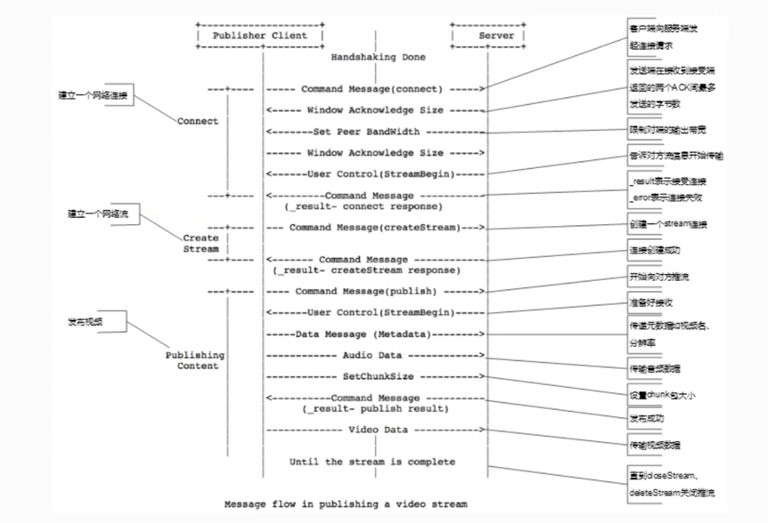
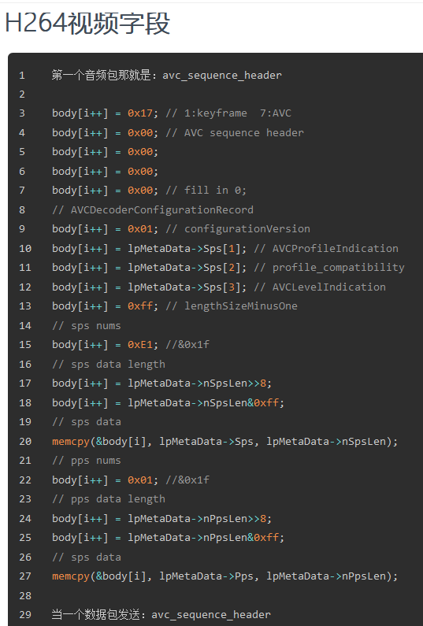


## RtmpPublisher

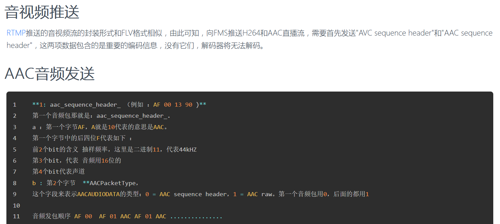
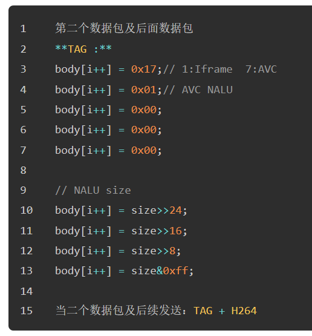
RtmpPublisher 的推流流程可以拆分为以下几个阶段：  

1. 实例创建  
   • 通过静态工厂函数 `RtmpPublisher::Create(event_loop)` 构造一个共享指针实例，内部保存事件循环指针，用于后续任务调度。  

2. 设置媒体信息（SetMediaInfo）  
   1) 保存上传的 `MediaInfo`，其中包含：  
      – `audio_codec_id`、`audio_specific_config`（AAC 配置）  
      – `video_codec_id`、`sps`/`pps`（H.264 序列参数集）  
   2) 如果是 AAC 音频：  
      – 根据 `audio_specific_config_size` + 2 字节，构造 `aac_sequence_header_`，前两个字节填充音频 Tag (0xAF, 0x00)，后面拷贝 AudioSpecificConfig。  
   3) 如果是 H.264 视频：  
      – 构造 `avc_sequence_header_`（长度足够的缓冲区），按 FLV AVCDecoderConfigurationRecord 格式写入：  
         · 0x17/0x27（关键帧/普通帧 + AVC sequence header 标志）  
         · 版本号、Profile、兼容性、Level、长度字段等  
         · SPS 数量 + SPS 长度 + SPS 数据  
         · PPS 数量 + PPS 长度 + PPS 数据  
      – 记录 `avc_sequence_header_size_`。  

3. 建立 RTMP 连接（OpenUrl）  
   1) 调用 `ParseRtmpUrl(url)` 解析出 TCP 目标 IP、端口和应用名/流名；  
   2) 如果已有连接，则调用 `rtmp_conn_->DisConnect()` 并置空；  
   3) 使用底层 `TcpSocket`：  
      – `Create()` → `Connect(ip, port)`（超时或失败返回 -1）  
   4) 构造 `RtmpConnection` 对象，传入自身指针、事件调度器和已连通的 socket；  
   5) 调用 `rtmp_conn_->Handshake()` 完成 RTMP 客户端握手和连接、发布命令（connect/app/publish）。  

4. 推送视频帧（PushVideoFrame）  
   1) 前置检查：必须已连接且通道未关闭，数据长度 > 5；  
   2) 首次遇到关键帧（`IsKeyFrame(data,size)`）前：  
      – 如果非关键帧直接丢弃（返回 0）；  
      – 若是关键帧，标记 `has_key_frame_ = true`，并先后通过 `SendVideoData(0, avc_sequence_header_)`／`SendVideoData(0, aac_sequence_header_)` 发送 H.264 和 AAC 序列头；  
   3) 计算相对推流时间戳 `timestamp = timestamp_.Elapsed()`；  
   4) 构造 FLV Video Tag 负载：  
      – 前 2 字节：帧类型 + AVC PacketType（1 表示 NALU）；  
      – 3 字节：composition time（通常 0）；  
      – 4 字节：NALU 长度；  
      – 紧接 NALU 数据；  
   5) 调用 `rtmp_conn_->SendVideoData(timestamp, payload, payload_size)` 发送。  

5. 推送音频帧（PushAudioFrame）  
   1) 前置检查：已连接、通道未关闭、数据长度 > 0、且已发送过首个关键帧；  
   2) 计算时间戳 `timestamp = timestamp_.Elapsed()`；  
   3) 构造 FLV Audio Tag 负载：  
      – 首字节 0xAF（AAC、4:2 声道）  
      – 次字节 0x01（Raw AAC frame）  
      – 后续拷贝 AAC 原始数据；  
   4) 调用 `rtmp_conn_->SendAudioData(timestamp, payload, payload_size)` 发送。  

6. 关闭推流（Close）  
   • 如果有活动连接，先用本地智能指针保留 `RtmpConnection`，再置空 `rtmp_conn_`；  
   • 调用 `DisConnect()` 断开 RTMP TCP 连接，复位 `has_key_frame_ = false`。  

7. 连接状态查询（IsConnected）  
   • 仅当 `rtmp_conn_` 不为空且其 `IsClosed()` 返回 false 时，认为推流仍在线。  

8. 关键帧判断（IsKeyFrame）  
   1) 根据 NAL 单元前缀（00 00 01 或 00 00 00 01）定位 NALU 头；  
   2) 取 NAL 单元类型字段（byte & 0x1F），当类型为 5（IDR）或 7（SPS）即视为关键帧。  

——  
以上即 RtmpPublisher 从参数准备、连接建立、握手、首包序列头发送，到音视频帧打包并通过 RTMP 协议发出的完整流程。

## RtmpPushManager

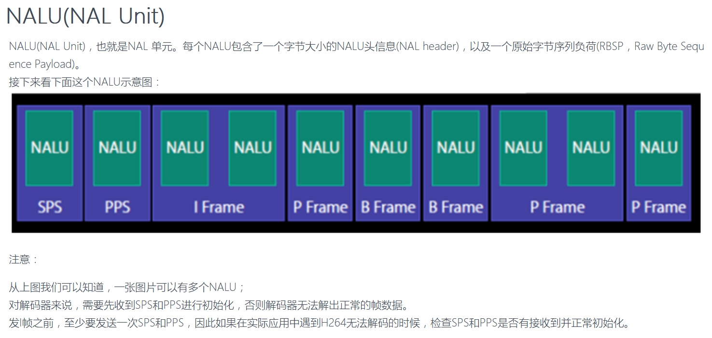
RtmpPushManager 的推流管理全流程，可分为以下几个阶段和关键步骤：  

1. 对象构造与析构  
   • 构造函数中：  
     – 创建一个专用的事件循环（EventLoop），用于调度 RTMP 握手、发送等异步任务。  
     – 内部指针（音频编码器、视频编码器、采集器、推流器）均初始化为空。  
   • 析构函数中：  
     – 调用 Close() 停止所有线程、断开连接并释放资源。  

2. 初始化（Init）  
   • 创建 RTMP 推流器实例（RtmpPublisher），并设置合适的块大小（ChunkSize），用于 FLV 分包发送。  
   • 屏幕采集器（GDIScreenCapture）初始化：打开 FFmpeg gdigrab，准备捕获桌面画面。  
   • 视频编码器（H264Encoder）打开：按指定分辨率、帧率、码率和输入像素格式（BGRA/RGBA）配置 H.264 编码器。  
   • 音频采集器（AudioCapture）初始化：打开 WASAPI 回环捕获，准备录制系统音频。  
   • 音频编码器（AACEncoder）打开：按采样率、声道数、输入格式（S16）和码率创建 AAC 编码器。  
   • 从视频编码器获取 SPS/PPS（序列参数集），从音频编码器获取 AudioSpecificConfig，并封装到 MediaInfo 结构中，调用推流器的 SetMediaInfo() 发送给服务端做解码准备。  
   • 若以上任一步骤失败，Init 返回 false，终止推流准备。  

3. 打开推流地址（Open）  
   • 调用推流器的 OpenUrl(推流地址, 超时时间)：  
     – 解析 RTMP 地址，得到服务器 IP、端口、应用名、流名等信息；  
     – 建立 TCP 连接，创建 RtmpConnection；  
     – 执行 RTMP 握手（Handshake）——connect/app/publish；  
   • 连接成功后，标记 isConnect = true。  
   • 启动两条后台线程：  
     – 视频采集线程：循环执行 EncodeVideo()；  
     – 音频采集线程：循环执行 EncodeAudio()；  

4. 视频循环采集—编码—推送（EncodeVideo）  
   • 以固定帧率（e.g. 30 fps）控制采集节奏：  
     – 每帧计算上次采集耗时，sleep 相应延迟；  
   • 调用屏幕采集器 CaptureFrame() 获取原始 BGRA 图像数据；  
   • 将 BGRA 数据送入视频编码器 Encode()：  
     – 内部先做像素格式／分辨率转换（BGRA→YUV420P），再送 H.264 编码器；  
     – 返回封装好的裸 H.264 NALU 数据包；  
   • 调用 PushVideo():  
     – 去除起始码（4 字节），剩余 NALU 直接通过推流器 PushVideoFrame() 发送；  
     – 首次遇到关键帧（IDR）前会丢弃非关键帧，遇到第一个关键帧时先发送 SPS/PPS，再发送视频帧。  

5. 音频循环采集—编码—推送（EncodeAudio）  
   • 不断查询音频采集器已有样本数（GetSamples()），当达到编码器一帧所需样本数时：  
     – 调用 Read() 从环形缓冲中读 PCM 数据；  
     – 送入 AAC 编码器 Encode()，获得 AAC 原始帧（ADTS 或 Raw）；  
     – 调用 PushAudio():  
       · 直接把 AAC 数据通过推流器 PushAudioFrame() 发送；  
       · 首次发送关键视频帧时，先发送 AAC 序列头。  

6. 停止与清理  
   • 调用 Close():  
     – 设置退出标志（exit_ = true）、断开连接标记（isConnect = false）；  
     – 如果推流器仍在线，调用其 Close() 断开 RTMP；  
     – 调用 StopEncoder()：  
       · 等待并停止视频/音频编码线程（join），销毁编码器实例；  
     – 调用 StopCapture()：  
       · 停止并销毁屏幕与音频采集器。  
   • 释放事件循环及其他所有资源。  

整个流程实现了“屏幕画面 + 系统声音”→“编码为 H.264/AAC”→“通过 RTMP 协议打包并发送”→“服务器解码播放”的闭环推流功能，支持首帧 SPS/PPS、稳定低延迟和并行处理。

## 什么是FLV格式？
FLV（Flash Video）是一种由 Adobe 推出的流媒体容器格式，用于在互联网上传输音视频。下面分几点详细说明其结构与特点：

1. 文件头（Header）  
   - 3 字节签名："F"、"L"、"V"  
   - 1 字节版本号（通常为 0x01）  
   - 1 字节标志：  
     · 位 0–2 保留  
     · 位 2（0x04）置 1 表示包含音频数据  
     · 位 0（0x01）置 1 表示包含视频数据  
   - 4 字节数据偏移（DataOffset）：从文件头到第一个 Tag 的字节数，通常固定 9  

2. Tag（标签）结构  
   FLV 的主体由一连串 Tag 组成，每个 Tag 存储一段音、视频或脚本数据。每个 Tag 包含：  
   - 4 字节“前一个 Tag 大小”（PreviousTagSize）：前一个 Tag（Header + Body）总长度  
   - 11 字节 Tag 头（Tag Header）：  
     · 1 字节 TagType（8=音频，9=视频，18=脚本数据）  
     · 3 字节 DataSize：TagBody 长度  
     · 3 字节 Timestamp：时间戳低 24 位（毫秒）  
     · 1 字节 TimestampExtended：时间戳高 8 位，用于支持超过 16 位的时间范围  
     · 3 字节 StreamID：一般为 0  
   - DataSize 字节 TagBody：具体负载  
   - 紧接下一个 PreviousTagSize  

3. 脚本数据 Tag（Script Data）  
   - TagType = 18  
   - 第一条通常是 `onMetaData`，存放 key/value 形式的元信息：宽度、高度、帧率、时长、音频采样率、声道数等  
   - 数据格式为 AMF0/AMF3 编码  

4. 音频 Tag（Audio Tag）  
   - TagType = 8  
   - TagBody 起始字节包含“SoundFormat”、“SoundRate”、“SoundSize”、“SoundType”字段，决定后续数据如何解析：  
     · SoundFormat：如 AAC（10）、MP3（2）等  
     · SoundRate：采样率编码（44 kHz/22 kHz……）  
     · SoundSize：每样本位宽（8 bit/16 bit）  
     · SoundType：单声道/立体声  
   - 对于 AAC，第一包通常是“AudioSpecificConfig”（序列头）；后续包则是 Raw AAC 数据  

5. 视频 Tag（Video Tag）  
   - TagType = 9  
   - TagBody 起始字节包含“FrameType + CodecID”：  
     · FrameType（高 4 位）：关键帧（1）、非关键帧（2）等  
     · CodecID（低 4 位）：如 AVC/H.264（7）、VP6（4）等  
   - 对于 AVC/H.264，后面跟一个 AVCPacketType（0=序列头，1=NALU，2=尾包）和 CompositionTime，然后是 NALU 数据  

6. 时间戳与同步  
   - 每个 Tag 都带有时间戳，客户端可据此实现音视频同步和缓冲  
   - 脚本数据里的 “duration” 可做整体进度显示  

7. 优点与应用  
   - 简单的包结构，适合流式传输  
   - 广泛支持 Flash 播放器和众多服务器（如 Nginx-RTMP、Wowza）  
   - 可封装多种音视频编解码器  

8. 注意事项  
   - FLV 不是压缩格式，只是容器；实际压缩由内部的 AAC、H.264 等编码器负责  
   - 最新 Web 播放多用 MP4/MPEG-TS/WebM，但 FLV 在 RTMP 推流场景仍非常常见  

通过上述标签化结构，FLV 能高效地对音视频帧进行实时打包、分发与播放。

# 客户端拉流模块
## 拉流界面UI
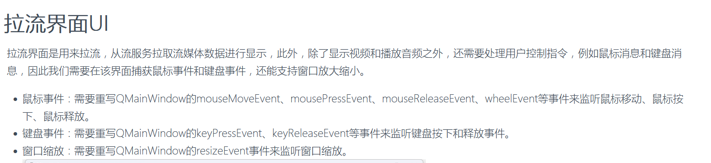

## 解码流程
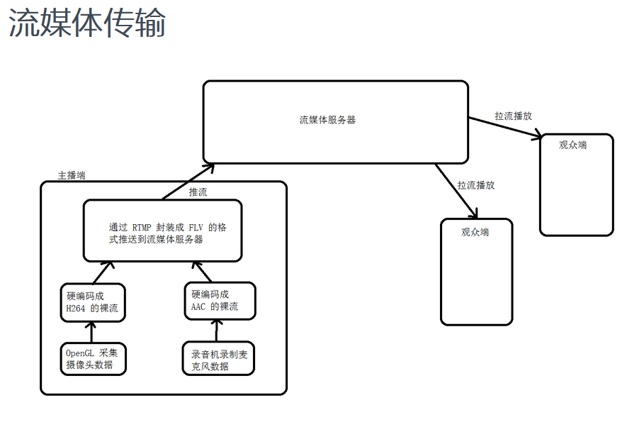
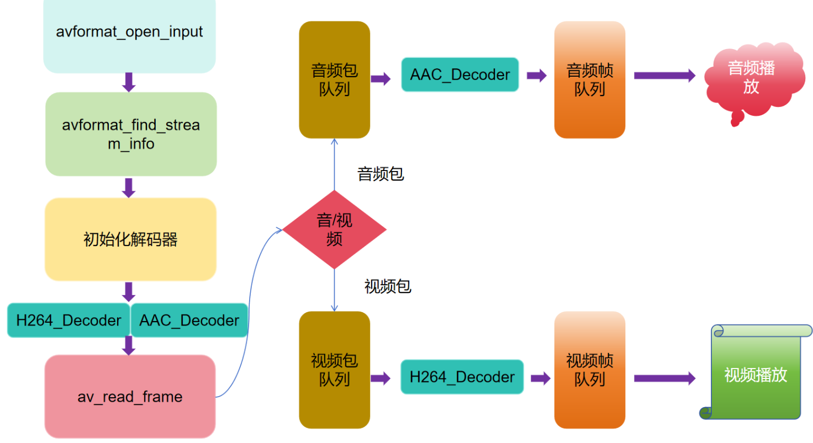
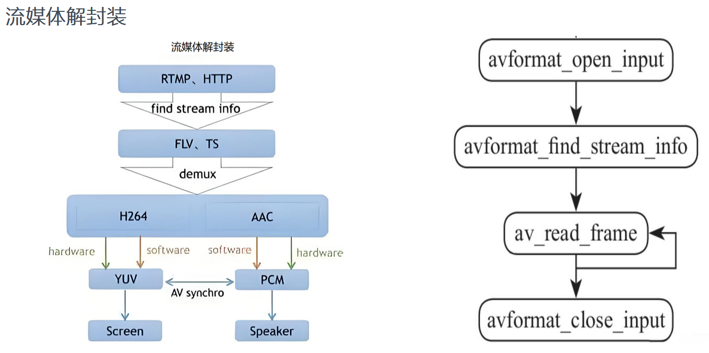

## AVDEMuxer 音视频解封装器

AVDEMuxer 的整体流程可以拆分成以下几个阶段，每步都对应着 AVDEMuxer.cpp／.h 中的具体实现：

1. 构造与初始化  
   - 构造函数中：  
     1) 用 `av_dict_set` 配置打开流时的选项（超时、分析时长、无缓冲、低延迟、重连策略等）；  
     2) 调用 `avformat_alloc_context` 分配一个格式化上下文 `AVFormatContext`；  
     3) 设置 `pFormateCtx_->interrupt_callback` 为静态方法 `InterruptFunction`，并把 `this` 绑定到其 `opaque`，用于后续在阻塞式读取中检查退出标志；  
     4) 创建 AAC 解码器和 H.264 解码器实例（`AAC_Decoder`、`H264_Decoder`），但尚未打开它们。  

2. 打开流（Open）  
   - `Open(path)` 只做一件事：在新线程（`std::thread`）里调用 `FetchStream(path)`，主线程立即返回 `true`，异步启动完整的打开／读取流程。  

3. 获取流信息并初始化解码器（FetchStreamInfo）  
   - 在 `FetchStream` 线程的开头，如果用户设置了 `streamCb_` 回调，会先调用：  
     1) `avformat_open_input(&pFormateCtx_, path, nullptr, &avDict_)` 打开 URL 或文件；  
     2) `avformat_find_stream_info(pFormateCtx_, nullptr)` 读取并解析流信息；  
     3) 遍历 `pFormateCtx_->streams`，识别出音频流（`codec_type==AVMEDIA_TYPE_AUDIO`）和视频流（`...==AVMEDIA_TYPE_VIDEO`），记录它们的索引 `audioIndex`、`videoIndex`，并用 `stream->duration*av_q2d(stream->time_base)` 计算各自时长，保存到外部 `AVContext`；  
     4) 分别调用 `h264Decoder_->Open(...)` 和 `aacDecoder_->Open(...)`，把找到的 `codecpar`（编码参数）传入，初始化解码器；一旦失败则清理并返回 `false`。  
   - 把是否成功的标志通过 `streamCb_(ret)` 通知 UI 或上层逻辑。

4. 异步读取并分发数据包（FetchStream）  
   进入主循环：  
   - 循环条件是 `!quit_ && pFormateCtx_ != nullptr`；  
   - 每次循环：  
     1) 用 `av_packet_alloc()` 分配一个 `AVPacket` 智能指针；  
     2) 调用 `av_read_frame(pFormateCtx_, packet)` 读取下一个分片（Packet）；  
     3) 如果返回 `0`（成功），检查 `packet->stream_index`：  
        ‑ 若等于 `videoIndex`，则 `h264Decoder_->put_packet(packet)`；  
        ‑ 若等于 `audioIndex`，则 `aacDecoder_->put_packet(packet)`；  
        ‑ 否则调用 `av_packet_unref(packet)` 丢弃；  
     4) 若 `av_read_frame` 返回错误（非 0），则释放包并跳出循环。  

5. 中断机制（InterruptFunction）  
   - FFmpeg 在内部做阻塞型 I/O（比如网络拉流）时，会定期调用你设置的 `interrupt_callback`；  
   - 该回调执行 `return thiz->quit_;`，当外部调用 `Close()` 把 `quit_ = true`，就会让 FFmpeg 的读操作立即返回中断错误，从而尽快退出循环。  

6. 关闭与资源释放（Close）  
   - 外部或析构时调用：  
     1) 设置 `quit_ = true`，触发上一步的中断；  
     2) 如果有字典选项 `avDict_`，调用 `av_dict_free(&avDict_)`；  
     3) 如果读取线程存在且可 join，就 `join` 并释放智能指针；  
     4) 如果 `pFormateCtx_` 不为空，调用 `avformat_close_input(&pFormateCtx_)` 关闭和释放格式上下文；  
     5) `AAC_Decoder`、`H264_Decoder` 在其析构时也会各自释放内部资源。  

7. 时长查询接口  
   - `audioDuration()`／`videoDuration()` 直接返回早前在 `FetchStreamInfo` 中保存到 `AVContext` 的音视频时长，供 UI 显示或进度控制使用。  

——  
通过上述步骤，AVDEMuxer 实现了：  
1) 异步打开任意流或文件；  
2) 基于字典选项和中断回调，实现快速启动、低延迟和可中断的读取；  
3) 自动识别并分发音视频数据到各自的解码器队列，以便后续解码渲染或播放。

AVDEMuxer 的整体工作流程，可分为以下几个阶段，用中文术语来替代那些晦涩的英文名词：  

1. 构造与初始化  
   - **字典配置**：用“字典设置”（av_dict_set）指定网络超时、极速分析、无缓冲、低延迟、重连策略等选项。  
   - **创建格式化上下文**：调用“分配格式上下文”（avformat_alloc_context）得到一个用于打开和解析媒体流的核心结构。  
   - **中断回调注册**：在格式化上下文里绑定一个“中断回调”函数，当外部要求退出时（quit_ 标志置为真），内部阻塞读操作会立刻返回，从而中断网络或文件读取。  
   - **解码器实例化**：先分别创建 AAC 解码器和 H.264 解码器，但此时尚未打开实际解码器。

2. 打开媒体流（Open）  
   - 调用 Open(path) 时，不直接阻塞，而是**新建一个后台线程**，在线程里执行真正的“打开并读取”流程（FetchStream），主线程立即返回。

3. 获取流信息并初始化解码器（FetchStreamInfo）  
   在线程里，首先执行：  
   1) **打开输入**：调用“打开输入流”（avformat_open_input），给定 URL 或文件路径和前面配置好的字典，建立网络/文件连接并准备读取。  
   2) **读取流信息**：调用“查找流信息”（avformat_find_stream_info），快速扫描并解析媒体流里的所有子流（音频流、视频流等）。  
   3) **遍历子流**：检查每一路“流参数”（codecpar），找出音频流和视频流的索引，并计算它们的总时长（duration × time_base），保存到外部上下文以供 UI 显示。  
   4) **打开解码器**：将找到的音频流参数传给 AAC 解码器，视频流参数传给 H.264 解码器，调用它们的“打开解码器”接口完成内部资源分配和准备。  

4. 异步循环读取并分发数据包（FetchStream）  
   在同一个后台线程中：  
   - 只要退出标志没被置位，就不断调用“读取数据包”（av_read_frame），每次获得一个 AVPacket（二进制数据包）。  
   - 根据 packet->stream_index 判断它是视频包还是音频包：  
     • **视频包** 交给 H.264 解码器的“接收数据包”接口；  
     • **音频包** 交给 AAC 解码器的“接收数据包”接口；  
     • 其他非音视频包直接丢弃。  
   - 如果读取失败（网络断开、文件结束），跳出循环，结束线程。

5. 中断退出机制  
   - 外部调用 Close() 时，设置退出标志（quit_ = true）；  
   - FFmpeg 在内部的网络或文件读取中，会定期调用注册的“中断回调”，一旦回调返回非零，就会让 av_read_frame 等阻塞函数立即返回错误，从而快速结束读取线程。

6. 关闭与释放（Close）  
   - **设置退出标志**：通知后台线程中断循环；  
   - **释放字典**：调用 av_dict_free 清理打开时的配置字典；  
   - **回收读取线程**：如果线程还在运行，则 join 等待其结束并释放；  
   - **关闭格式上下文**：调用 avformat_close_input 关闭网络/文件连接并释放所有内部缓存；  
   - 解码器对象在其析构时也会自动释放各自的解码上下文和缓冲。

7. 时长查询  
   - `audioDuration()`／`videoDuration()` 直接返回在“读取流信息”阶段保存到外部上下文的音视频总时长（单位秒），方便上层 UI 或播放进度条使用。

——  
通过以上步骤，AVDEMuxer 实现了“异步打开媒体流 → 快速获取音视频流信息 → 循环读取数据包 → 分发给各自解码器 → 支持中断退出 → 资源自动回收” 的完整解复用（de-mux）流程。

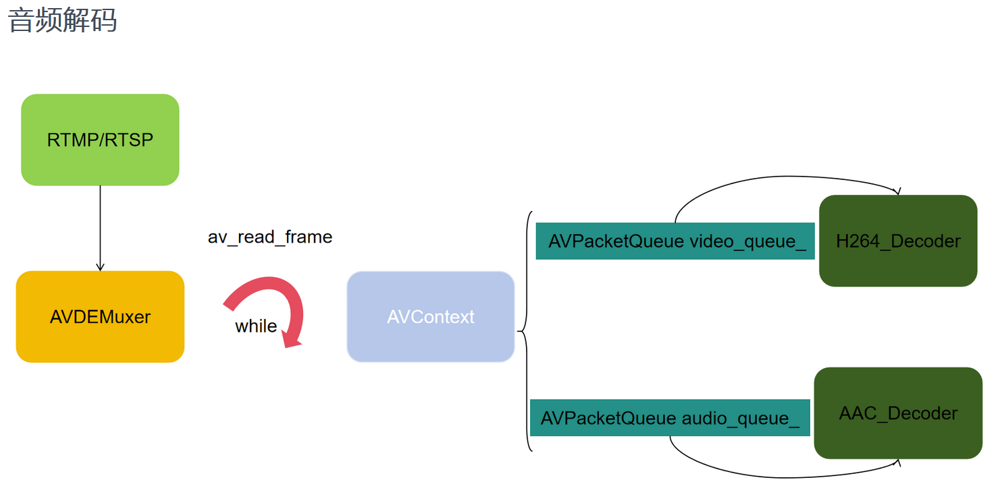

## AAC_Decoder
AAC_Decoder 的处理流程可以分为以下几大阶段，用中文术语来说明每一步的功能和调用顺序：

1. 对象构造  
   - 构造时仅完成成员初始化：  
     • 创建一个 AudioResampler 对象，用于后续重采样；  
     • 初始化状态标志 `is_initial_ = false`、退出标志 `quit_ = false`。  

2. 打开解码器（Open）  
   调用 `Open(codecParamer)` 完成 AAC 解码器和重采样器的准备：  
   2.1 参数检查：若已打开或传入参数为空，返回失败。  
   2.2 查找解码器：通过 `avcodec_find_decoder(codec_id)` 获取 AAC 解码器。  
   2.3 分配上下文：`avcodec_alloc_context3()` 创建 AVCodecContext，并用 `avcodec_parameters_to_context()` 将流参数拷贝进去。  
   2.4 打开解码器：设置加速标志 `AV_CODEC_FLAG2_FAST` 后调用 `avcodec_open2()`；  
   2.5 重采样配置：  
     - 在外部 AVContext 中写入目标声道布局（立体声）、采样格式（S16）、采样率（44.1 kHz）；  
     - 调用 `audioResampler_->Open(输入率, 输入声道, 输入格式, 44100, 2, AV_SAMPLE_FMT_S16)` 初始化重采样器。  
   2.6 启动解码线程：设置 `is_initial_ = true`，调用 `start()` 进入 `run()` 循环。  

3. 解码循环（run）  
   以后台线程形式不断从内部 packet 队列取包并解码：  
   (这个音频解码队列是个环形缓冲区)
   3.1 等待数据包：如果队列为空，thread 睡眠 1 ms 后重试。  
   3.2 取出 AAC 数据包：`audio_queue_.pop(pkt)`。  
   3.3 送包到解码器：`avcodec_send_packet(codecCtx_, pkt)`；若失败则退出循环。  
   3.4 接收原始帧：循环调用 `avcodec_receive_frame(codecCtx_, pFrame)`，直到返回 EAGAIN/EOF。  
   3.5 重采样：对每个成功解码的 AVFrame，调用 `audioResampler_->Convert(pFrame, outframe)` 将样本转换到 S16/44.1 kHz/立体声平面格式。  
   3.6 推送 PCM：如果 `outframe` 有效，则 `avContext_->audio_queue_.push(outframe)`，由上层播放或推流模块消费。  

4. 关闭与清理（Close + 析构）  
   - 外部或析构时调用 `Close()`：  
     • 设置退出标志 `quit_ = true`；  
     • 若线程仍在运行，依次调用 `quit()`、`wait()` 等待线程安全退出；  
   - 解码线程退出后，AVCodecContext、AudioResampler、内部队列等资源由各自析构函数释放。  

整个流程保证了：  
• 异步地将网络/文件中的 AAC 压缩包转为原始 PCM；  
• 通过 AudioResampler 统一到目标采样率、声道和格式；  
• 解码后的 PCM 帧安全地放入 AVContext 的队列，为后续音频播放或推流提供数据。

“异步”主要体现在两个地方：

1. AVDEMuxer 解复用线程  
   在 `AVDEMuxer::Open()` 中并不直接阻塞打开和读取，而是启动了一个后台线程去执行 `FetchStream(path)`，主线程立即返回。这样，网络/文件的拉流和分包是在专门的线程里异步进行的。

2. AAC_Decoder 解码线程  
   在 `AAC_Decoder::Open(...)` 里调用了 `start()`，它继承自 `QThread`，会在一个独立线程里运行 `run()` 方法：  
   - 上层通过 `put_packet(pkt)` 将压缩包推入 `audio_queue_`（线程安全队列）。  
   - 解码线程则不断从 `audio_queue_` 中弹出包，调用 `avcodec_send_packet`/`avcodec_receive_frame` 解码并重采样，最后再把 PCM 帧推回到 `AVContext` 的队列。  

这两个线程与主流程互不阻塞，便实现了“异步地将网络/文件中的 AAC 压缩包转为原始 PCM”。

H264_Decoder 的完整流程可分为以下几个阶段，用中文术语描述其内部各步细节：

1. 对象构造  
   - 构造函数中仅完成成员初始化：  
     • 用 `av_frame_alloc` 分配一个 AVFrame 用于存放解码后原始 YUV 帧；  
     • 创建一个 VideoConverter 实例，用于后续像素格式／分辨率转换；  
     • 初始状态下线程尚未启动、退出标志（quit_）为假。

2. 打开解码器（Open）  
   当收到来自 AVDEMuxer 的流参数（AVCodecParameters）后：  
   1) **参数校验**：如果已初始化或参数为空，立即返回失败。  
   2) **查找解码器**：调用“查找解码器”（avcodec_find_decoder）获取 H.264 解码器。  
   3) **分配解码上下文**：通过“分配解码上下文”（avcodec_alloc_context3）创建 AVCodecContext。  
   4) **拷贝流参数**：使用“复制流参数到上下文”（avcodec_parameters_to_context），将宽高、码率、像素格式等信息填入上下文。  
   5) **设置加速标志**：为上下文开启快速解码选项（AV_CODEC_FLAG2_FAST）。  
   6) **打开解码器**：调用“打开解码器”（avcodec_open2），失败则清理并返回。  
   7) **更新全局上下文**：将解码器输出宽度、高度和默认像素格式（YUV420P）写入 AVContext，以供 UI 或后续模块查询。  
   8) **初始化像素转换器**：调用 VideoConverter::Open，将解码器输出的像素格式（如 NV12、YUV420P 等）和尺寸，转换为目标格式（YUV420P）和同一尺寸，准备好 sws_scale。  
   9) **启动解码线程**：标记已初始化（is_initial_ = true），调用 QThread::start()，进入后台解码流程。

3. 异步解码循环（run）  
   在线程入口 `run()` 中反复执行：  
   1) **检查退出**：只要退出标志（quit_）为假且转换器存在，就继续。  
   2) **等待数据包**：如果内部包队列为空，短暂休眠（1ms）后重试，以避免忙等。  
   3) **弹出一个包**：从环形缓冲区 `video_queue_` 中取出一个 AVPacket（H.264 码流单元）。  
   4) **送入解码器**：调用 “发送包到解码器”（avcodec_send_packet），如果失败（返回非 0），跳出循环。  
   5) **接收原始帧**：循环调用 “接收解码帧”（avcodec_receive_frame）直到返回 EAGAIN/EOF：  
      - 每次成功接收后，AVFramePtr 中保存解码后的 YUV 平面数据。  
   6) **像素格式转换**：对每个得到的 YUV 原始帧，调用 VideoConverter::Convert，将其转换成目标格式（YUV420P）并产出一个新的 AVFrame。  
   7) **推入输出队列**：将转换后的帧（AVFramePtr）推入 AVContext 的 `video_queue_` 中，供渲染或其他消费端使用。

4. 关闭与清理（Close）  
   - 外部调用 Close() 或析构时：  
     1) 将退出标志（quit_）置真；  
     2) 如果线程正在运行，则调用 QThread 的 `quit()` 和 `wait()`，等待安全退出；  
   - 线程结束后，AVCodecContext、VideoConverter、AVFramePtr、内部队列等资源由各自析构器自动回收。

整个流程保证了 H.264 码流的“异步解复用 → 异步解码 → 像素格式转换 → 推入帧队列”闭环，各环节均在独立线程或队列里运行，既不阻塞主流程，也能持续高效地产出可渲染的 YUV 帧。

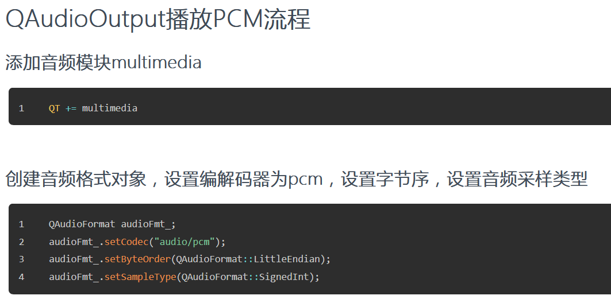
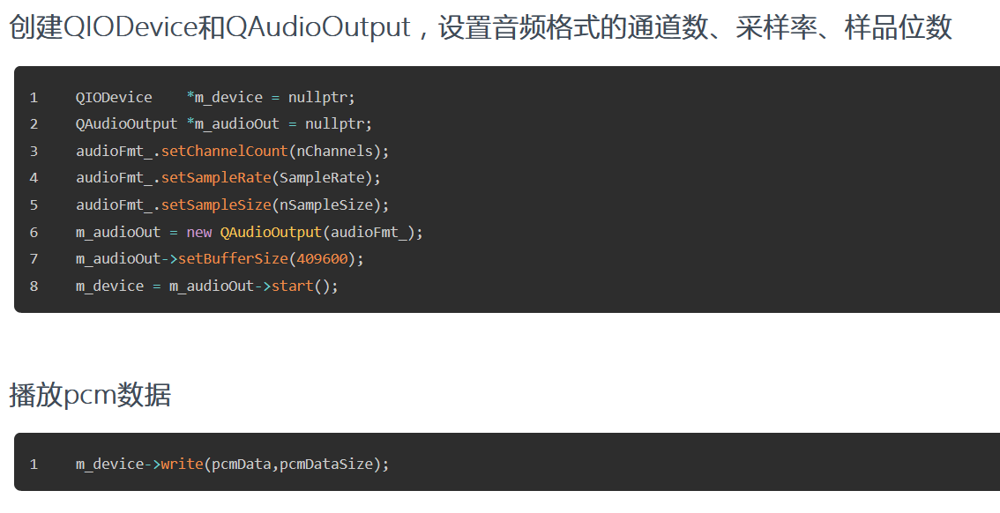

## AudioRender音频渲染与播放
AudioRender 的工作流程主要分成“初始化”、“查询缓冲”、“写入播放”三个阶段：  

1. 构造阶段  
   - 构造函数中只做格式预设：  
     • Codec = “audio/pcm”  
     • 字节序 = 小端（Little Endian）  
     • 样本类型 = 有符号整型（Signed Int）  

2. 初始化阶段（调用 InitAudio）  
   1) 参数检查：如果已初始化或设备已创建，直接返回成功。  
   2) 保存样本位宽（nSampleSize）。  
   3) 在 QAudioFormat 上设置：声道数、采样率、样本位宽。  
   4) 创建 QAudioOutput：  
      - 调用 new QAudioOutput(audioFmt_)  
      - 调用 setBufferSize(409600) 配置缓冲区大小  
      - 调用 setVolume(volume_) 配置初始音量  
   5) 启动输出设备：调用 audioOut_->start()，返回一个 QIODevice*（device_），用于后续写入。  
   6) 标记初始化完成（is_initail_ = true）。  

3. 缓冲查询（AvailableBytes）  
   - 在播放前可调用此接口，返回当前音频输出剩余可写字节数（bytesFree – periodSize），若未初始化则返回 –1。  
   - 用于控制“写入速率”或判断是否需要丢帧/等待。  

4. 播放写入（Write）  
   1) 前置检查：确保 device_、audioOut_ 有效且已设置样本位宽。  
   2) 从 AVFramePtr 拿到 PCM 数据指针和样本数：  
      - 数据长度 = nb_samples * channels * (nSampleSize/8) 字节  
   3) 构造 QByteArray 包装这段数据。  
   4) 调用 device_->write() 将 PCM 原始数据推送到音频硬件缓冲区，实现播放。  
   5) 完成后调用 av_frame_unref() 释放 AVFrame 内部缓存，避免内存泄漏。  

整个流程保证了：  
- 只需一次 InitAudio 即可配置好底层音频输出；  
- 上层只管往 Write() 里丢解码得到的 PCM 帧，Qt 底层会异步地把数据送到声卡；  
- 通过 AvailableBytes 可实时监控输出缓冲状态，避免写入过快或过慢引起卡顿或延迟累积。

## 音频设备？
音频最终是通过 Qt Multimedia 的 QAudioOutput 播放到系统的默认输出设备（如扬声器或耳机）上的。具体流程如下：

1. “找设备”  
   在 `InitAudio()` 中我们没有显式指定设备，Qt 就会使用  
   QAudioDeviceInfo::defaultOutputDevice()（系统默认音频输出）  
   来创建 `QAudioOutput` 对象。所以播放设备就是操作系统当前的默认音频输出。

2. 配置格式  
   我们先用 `QAudioFormat` 指定：  
   • 声道数（`setChannelCount`）  
   • 采样率（`setSampleRate`）  
   • 样本位宽（`setSampleSize`）  
   • 编解码器、字节序、采样类型等  

3. 打开输出通道  
   ```cpp
   audioOut_ = new QAudioOutput(audioFmt_);
   device_   = audioOut_->start();
   ```  
   - `new QAudioOutput(audioFmt_)` 内部会调用默认设备对应的底层接口（Windows 下是 WASAPI/DirectSound、Linux 下是 ALSA/PulseAudio）  
   - `start()` 返回一个 `QIODevice*`，这个 IO 设备即向音频硬件写数据的“管道”。

4. 播放数据  
   在 `Write(AVFramePtr frame)` 里：  
   1) 从解码器拿到的 PCM 数据放到一个 `QByteArray`  
   2) 调用 `device_->write()` 把这段字节写入到 QAudioOutput 的缓冲区  
   3) Qt 会异步地把缓冲区里的 PCM 数据交给操作系统音频子系统，再由声卡驱动输出到扬声器/耳机  

这样，上层调用 `Write()` 时只是把原始 PCM 数据丢给 `QIODevice`，Qt 和系统音频子系统会自动负责把声音“送到”真实的播放设备上。

## 视频硬件加速渲染OpenGL
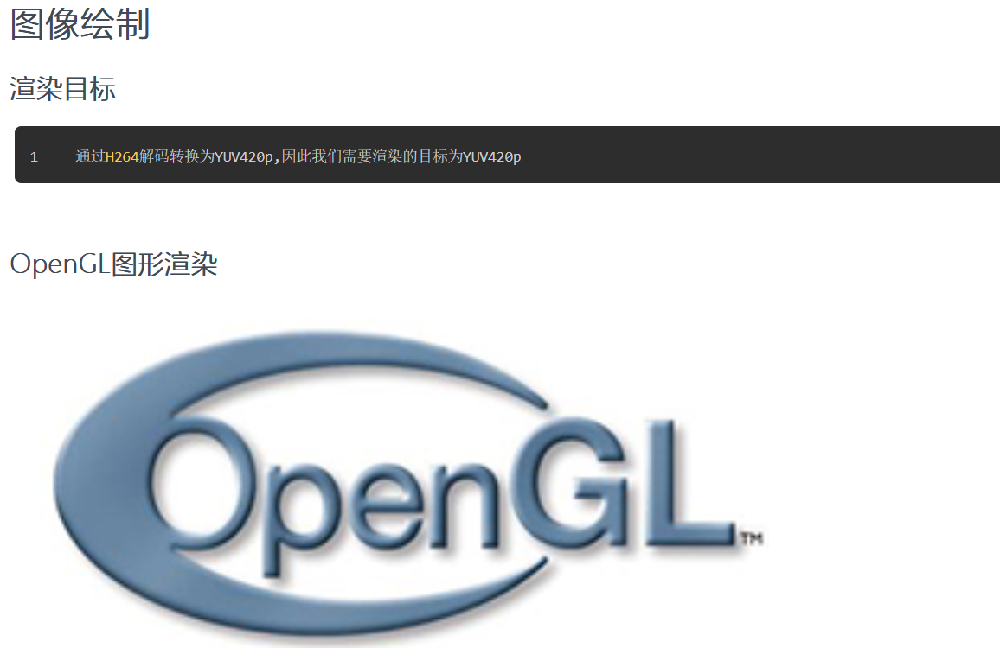
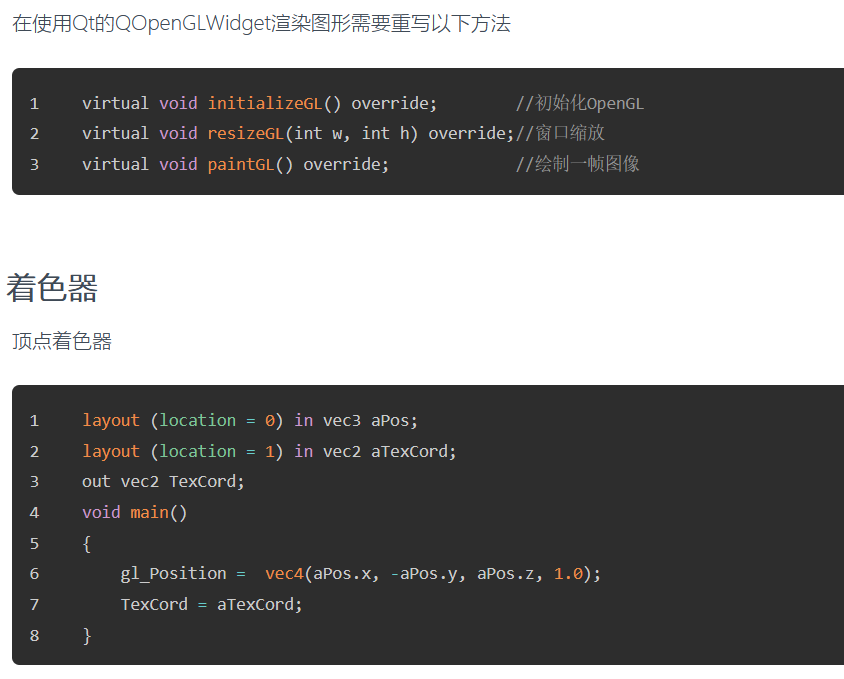
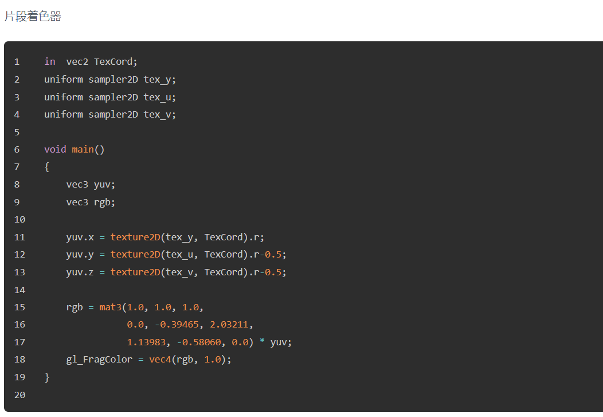
好的，我们来详细叙述 `OpenGLRender` 的完整工作流程。这个类是视频渲染的核心，它利用 GPU 的能力高效地将解码后的 YUV 视频帧显示在屏幕上。

整个流程可以分为以下几个关键阶段：

### 1. 初始化阶段 (`initializeGL`)

当 `OpenGLRender` 窗口部件第一次显示时，这个函数会被自动调用一次，完成所有一次性的准备工作：

1.  **加载 OpenGL 函数**: 调用 `initializeOpenGLFunctions()`，让 Qt 帮忙加载当前平台和版本（OpenGL 3.3 Core）对应的所有函数指针。
2.  **编译着色器**:
    *   创建一个 `QOpenGLShaderProgram` 对象。
    *   加载顶点着色器 (`.vsh`) 和片段着色器 (`.fsh`) 的源码。这两个文件被编译到 Qt 的资源文件中，所以可以用 `:/` 路径访问。
    *   **顶点着色器**：非常简单，它的任务是接收顶点坐标 (`aPos`) 和纹理坐标 (`aTexCoord`)，然后把它们原封不动地传递给下一阶段。搭一个矩形框架即可。
    *   **片段着色器**：这是渲染的核心。它接收从顶点着色器传来的纹理坐标，然后用这个坐标分别从 Y、U、V 三个纹理中采样，得到 YUV 值。最后，它通过一个标准的数学公式，在 GPU 上实时地将 YUV 颜色转换为 RGB 颜色，并输出到屏幕。
    *   调用 `program_->link()` 将两个着色器链接成一个完整的 GPU 程序。
3.  **设置顶点数据**:
    *   创建一个**顶点数组对象 (VAO)**，它像一个容器，可以保存后续所有的顶点状态配置。
    *   创建一个**顶点缓冲对象 (VBO)**，并将一个矩形的四个顶点数据（每个顶点包含 3 个位置坐标和 2 个纹理坐标）上传到 VBO 中。
    *   创建一个**元素缓冲对象 (EBO)**，并将顶点索引（两个三角形，共 6 个索引）上传到 EBO 中。这告诉 OpenGL 如何用 VBO 中的顶点来组成三角形。
    *   配置**顶点属性指针** (`glVertexAttribPointer`)，告诉 OpenGL 在 VBO 中，每 5 个浮点数是一组，前 3 个是位置，后 2 个是纹理坐标。
4.  **设置清屏颜色**: 调用 `glClearColor()` 设置一个背景色（这里是黑色），在每帧绘制前清空屏幕时使用。

### 2. 接收新视频帧 (`Repaint`)

这是从外部（解码线程）向渲染器“喂”数据的入口函数。

1.  解码器解码出一帧视频 (`AVFramePtr`) 后，调用 `Repaint(frame)`。
2.  函数首先检查帧是否有效。
3.  如果这是第一帧，它会隐藏并删除用于显示“加载中”动画的 `QLabel`。
4.  最关键的一步是调用 `repaintTexYUV420P(frame)`，将帧数据上传到 GPU。
5.  最后，调用 `this->update()`。这是一个非阻塞函数，它会向 Qt 的事件循环请求一次重绘。Qt 会在合适的时机自动调用 `paintGL()`。

### 3. 更新纹理 (`repaintTexYUV420P` 和 `initTexYUV420P`)

这是 `Repaint` 内部调用的核心逻辑，负责处理视频帧数据。

1.  **检查分辨率变化**: `repaintTexYUV420P` 首先检查新帧的宽高是否与上一帧相同。如果不同，说明视频流的分辨率变了，需要调用 `freeTexYUV420P()` 销毁旧的纹理，然后重新创建。
2.  **初始化纹理**: `initTexYUV420P` 负责创建纹理。
    *   如果 Y、U、V 纹理 (`texY_`, `texU_`, `texV_`) 还不存在，就分别为它们创建 `QOpenGLTexture` 对象。
    *   为每个纹理设置大小。注意，对于 YUV420P 格式，U 和 V 分量的宽高都是 Y 分量的一半。
    *   设置纹理的过滤方式（`Linear`，线性插值，使画面更平滑）和格式（`R8_UNorm`，表示这是一个单通道 8 位无符号归一化纹理）。
    *   调用 `allocateStorage()` 为纹理在 GPU 上分配显存。
3.  **上传数据**: `repaintTexYUV420P` 回到主流程，使用 `tex->setData()` 函数，将 `AVFrame` 中的 `data[0]` (Y)、`data[1]` (U)、`data[2]` (V) 的像素数据分别上传到对应的三个纹理中。这里会正确设置 `linesize`（行字节数）以处理内存对齐问题。
tex->setData() 就是一座桥梁，它负责将 AVFrame 中的 Y、U、V 三个分量的像素数据，分别拷贝到 GPU 上对应的三个纹理对象 (texY_, texU_, texV_) 中。

### 4. 渲染绘制 (`paintGL`)

当 Qt 响应 `update()` 请求时，这个函数被自动调用，执行真正的绘制操作。

1.  **清空屏幕**: 调用 `glClear(GL_COLOR_BUFFER_BIT)`，用 `initializeGL` 中设置的颜色清空画布。
2.  **设置视口**: 调用 `glViewport()`，使用在 `resizeGL` 中计算好的位置和大小来设置渲染区域。这确保了视频画面能保持原始宽高比并居中显示。
3.  **绑定资源**:
    *   `program_->bind()`: 激活之前编译好的着色器程序。
    *   `texY_->bind(0)`, `texU_->bind(1)`, `texV_->bind(2)`: 将 Y、U、V 三个纹理分别绑定到 0、1、2 号纹理单元。这与着色器中 `uniform sampler2D` 变量的设置相对应。
    *   `glBindVertexArray(VAO)`: 绑定顶点数组对象，恢复所有顶点相关的状态。
4.  **执行绘制**: 调用 `glDrawElements()`，向 GPU 发出最终的绘制指令。GPU 会根据当前绑定的 VAO、着色器和纹理，绘制出由 6 个索引定义的两个三角形，形成一个完整的视频画面。
5.  **解绑资源**: 绘制完成后，释放所有绑定的资源。

### 5. 窗口缩放 (`resizeGL`)

当用户拖动改变窗口大小时，此函数被自动调用。

1.  它会比较当前窗口的宽高比和视频帧的原始宽高比。
2.  根据比较结果，计算出一个新的、经过缩放的尺寸 (`m_zoomSize`) 和一个居中的位置 (`m_pos`)。
3.  这个计算结果被保存下来，并在每次 `paintGL` 时用于设置 `glViewport`，从而实现视频画面的等比缩放，避免拉伸。

### 6. 资源释放 (`~OpenGLRender`)

当 `OpenGLRender` 对象被销毁时，析构函数会确保所有申请的 OpenGL 资源被正确释放，包括 VBO、EBO、VAO 和三个纹理，防止显存泄漏。

通过这一整套流程，`OpenGLRender` 实现了一个高效、健壮的视频渲染器，它将复杂的 YUV 到 RGB 转换和绘制工作完全交给了 GPU，极大地解放了 CPU，保证了流畅的播放体验。

## 着色器的作用
好的，我们来详细解释一下这两个概念以及它们在这个项目中的具体作用。

### 什么是顶点着色器和片段着色器？

**着色器（Shader）** 可以理解为运行在 **GPU（显卡）** 上的、专门用于图形计算的微型程序。现代图形渲染管线是可编程的，而着色器就是我们编写的、用于控制管线特定阶段的代码。其中最核心、最常用的两个就是顶点着色器和片段着色器。

#### 1. 顶点着色器 (Vertex Shader)

*   **作用对象**：**每一个顶点 (Vertex)**。
*   **核心任务**：计算每个顶点的**最终位置**。它接收模型原始的顶点坐标（例如，一个立方体的八个角点），然后通过一系列数学变换（如模型、视图、投影矩阵变换），计算出这个顶点最终应该出现在屏幕上的哪个位置（裁剪空间坐标）。
*   **其他任务**：它可以向下一个阶段（片段着色器）传递数据。例如，它可以把顶点的颜色、法线、或者**纹理坐标**传递下去。
*   **简单比喻**：它就像一个“骨架操纵师”，负责确定一个物体的基本形状和在屏幕上的位置。

#### 2. 片段着色器 (Fragment Shader)

*   **作用对象**：**每一个片段 (Fragment)**。一个“片段”可以看作一个“准像素”，它包含了计算一个像素最终颜色所需的所有信息。
*   **核心任务**：计算每个片段的**最终颜色**。它接收从顶点着色器传递并经过**插值**的数据（例如，一个三角形内部某一点的纹理坐标，是由其三个顶点的纹理坐标插值计算得出的）。
*   **工作方式**：它利用接收到的数据（如纹理坐标、光照信息等）进行计算，最终输出一个 RGBA 颜色值。这个颜色值就是你在屏幕上看到的那个像素的颜色。
*   **简单比喻**：它就像一个“上色师”或“像素画家”，负责为物体的表面填充颜色和细节。

---

### 这里的两个着色器有什么用？

在这个项目中，我们的目标是在一个矩形区域内显示视频。这两个着色器协同工作，高效地完成了这个任务。

#### 1. 顶点着色器 (`vertexShaderSource`) 的作用

```glsl
// ...existing code...
const char* vertexShaderSource = "#version 330 core\n"
    "layout (location = 0) in vec3 aPos;\n"
    "layout (location = 1) in vec2 aTexCoord;\n"
    "out vec2 TexCoord;\n"
    "void main()\n"
    "{\n"
    "   gl_Position = vec4(aPos, 1.0);\n"
    "   TexCoord = aTexCoord;\n"
    "}";
// ...existing code...
```

这个顶点着色器非常简单，它做了两件事：

1.  **`gl_Position = vec4(aPos, 1.0);`**: 它直接将输入的顶点位置 `aPos` 作为最终输出位置。因为我们只是想画一个填满视口的2D矩形，所以不需要进行复杂的3D变换。
2.  **`TexCoord = aTexCoord;`**: 它将输入的纹理坐标 `aTexCoord` **原封不动地传递**给片段着色器。这是关键的一步，它告诉片段着色器，“对于屏幕上的这个点，你应该去纹理的哪个位置采样颜色”。

**总结：它的作用就是画一个矩形，并为这个矩形的每个像素准备好正确的纹理坐标。**

#### 2. 片段着色器 (`fragmentShaderSource`) 的作用

```glsl
// ...existing code...
const char* fragmentShaderSource = "#version 330 core\n"
    "out vec4 FragColor;\n"
    "in vec2 TexCoord;\n"
    "uniform sampler2D textureY;\n"
    "uniform sampler2D textureU;\n"
    "uniform sampler2D textureV;\n"
    "void main()\n"
    "{\n"
    "   float y = texture(textureY, TexCoord).r;\n"
    "   float u = texture(textureU, TexCoord).r - 0.5;\n"
    "   float v = texture(textureV, TexCoord).r - 0.5;\n"
    "   float r = y + 1.402 * v;\n"
    "   float g = y - 0.344 * u - 0.714 * v;\n"
    "   float b = y + 1.772 * u;\n"
    "   FragColor = vec4(r, g, b, 1.0);\n"
    "}";
// ...existing code...
```

这个片段着色器是整个渲染过程的核心，它的作用是 **在 GPU 上实时地将 YUV 颜色转换为 RGB 颜色**。

1.  **`in vec2 TexCoord;`**: 接收从顶点着色器传来的、经过插值的纹理坐标。
2.  **`uniform sampler2D textureY, textureU, textureV;`**: 声明了三个纹理采样器，分别对应我们从 C++ 代码中上传的 Y、U、V 三个分量的纹理。
3.  **`float y = texture(textureY, TexCoord).r;`**: 使用 `texture()` 函数和传入的 `TexCoord`，从 Y 纹理中采样亮度值。因为 YUV 的每个分量都是单通道的灰度图，所以我们只取其红色通道 `.r` 的值就足够了。
4.  **`float u = ... - 0.5;` 和 `float v = ... - 0.5;`**: 同样地，从 U 和 V 纹理中采样色度值。减去 0.5 是因为在标准的 YUV 转换公式中，U 和 V 分量需要以 0 为中心（范围从 -0.5 到 +0.5）。
5.  **`float r = ...; float g = ...; float b = ...;`**: 这三行是**标准的 YUV 到 RGB 的转换公式**。GPU 会为矩形内的**每一个像素**并行地执行这个计算。
6.  **`FragColor = vec4(r, g, b, 1.0);`**: 将计算出的最终 RGB 颜色（Alpha通道设为1.0，即不透明）作为这个像素的输出颜色。

**总结：它的作用是接收纹理坐标，从 Y、U、V 三个独立的纹理中采样，然后在 GPU 上飞快地完成颜色空间转换，计算出每个像素最终应该显示的 RGB 颜色。**

通过这种方式，我们将繁重的颜色转换计算从 CPU 转移到了高度并行的 GPU 上，从而实现了极为高效流畅的视频播放。


好的，我们来详细解释一下这三个在现代 OpenGL 中至关重要的概念，以及它们在这个项目中的具体作用。

可以把这三者想象成一套高效的“绘图工具箱”：

*   **VBO (顶点缓冲对象)**：是装满“原材料”（顶点数据）的仓库。
*   **EBO (元素缓冲对象)**：是“施工蓝图”（顶点索引）。
*   **VAO (顶点数组对象)**：是“配置好的工具台”，它知道去哪个仓库拿原材料，并按照哪张蓝图来施工。

---

### 1. VBO (Vertex Buffer Object) - 顶点缓冲对象

*   **是什么？**
    VBO 是 GPU 显存中的一块内存区域，专门用来存储大量的顶点数据，例如顶点坐标、颜色、法线、**纹理坐标**等。它的主要目的是一次性地将所有顶点数据从 CPU 内存发送到 GPU 显存，避免在每一帧都重复发送，从而极大地提升了渲染效率。

*   **在这里有什么用？**
    在 OpenGLRender.cpp 中，我们定义了一个静态数组 `vertices`：
    ```cpp
    static GLfloat vertices[] = {
        // 位置坐标      // 纹理坐标
         1.0f, 1.0f, 0.0f,  1.0f, 1.0f, // 右上
         1.0f,-1.0f, 0.0f,  1.0f, 0.0f, // 右下
        -1.0f,-1.0f, 0.0f,  0.0f, 0.0f, // 左下
        -1.0f, 1.0f, 0.0f,  0.0f, 1.0f  // 左上
    };
    ```
    这个数组定义了一个矩形的四个顶点。每个顶点有 5 个浮点数：前 3 个是位置坐标 (x, y, z)，后 2 个是纹理坐标 (s, t)。

    `initializeGL` 函数中的这几行代码就是 VBO 的作用：
    ```cpp
    // filepath: e:\cppprofile\ENET Demo\ECloudAssistant\Puller\Render\OpenGLRender.cpp
    // ...existing code...
    glGenBuffers(1, &VBO); // 在GPU上创建一个VBO
    glBindBuffer(GL_ARRAY_BUFFER, VBO); // 将其绑定为当前操作的顶点缓冲区
    glBufferData(GL_ARRAY_BUFFER, sizeof(vertices), vertices, GL_STATIC_DRAW); // 将vertices数组的数据复制到VBO中
    // ...existing code...
    ```
    **作用总结：VBO 在这里就是把我们定义的那个矩形的顶点数据（位置和纹理坐标）存储到了 GPU 的显存里。**

### 2. EBO (Element Buffer Object) - 元素缓冲对象

*   **是什么？**
    EBO，也常被称为索引缓冲对象 (IBO)，它同样是 GPU 显存中的一块内存。但它不存储顶点数据本身，而是存储**顶点索引**。这些索引告诉 OpenGL 应该按照什么顺序来绘制 VBO 中的顶点，从而组成几何图形（如三角形）。使用 EBO 可以有效地复用顶点，减少内存占用。

*   **在这里有什么用？**
    我们想用上面的 4 个顶点画一个矩形，而矩形是由两个三角形组成的。如果不使用 EBO，我们需要定义 6 个顶点（两个顶点会被重复定义）。但有了 EBO，我们只需定义 4 个唯一的顶点，然后用索引来告诉 OpenGL 如何组合它们。

    `indices` 数组就是这个“蓝图”：
    ```cpp
    static GLuint indices[] = {
        0, 1, 3, // 第一个三角形，使用顶点 0, 1, 3
        1, 2, 3  // 第二个三角形，使用顶点 1, 2, 3
    };
    ```
    `initializeGL` 函数中对应的代码：
    ```cpp
    // filepath: e:\cppprofile\ENET Demo\ECloudAssistant\Puller\Render\OpenGLRender.cpp
    // ...existing code...
    glGenBuffers(1, &EBO); // 在GPU上创建一个EBO
    glBindBuffer(GL_ELEMENT_ARRAY_BUFFER, EBO); // 绑定为当前操作的元素缓冲区
    glBufferData(GL_ELEMENT_ARRAY_BUFFER, sizeof(indices), indices, GL_STATIC_DRAW); // 将indices数组的数据复制到EBO中
    // ...existing code...
    ```
    **作用总结：EBO 在这里存储了绘制矩形所需的顶点顺序，它告诉 GPU 如何用 VBO 中的 4 个顶点画出两个三角形，从而拼成一个完整的矩形。**

### 3. VAO (Vertex Array Object) - 顶点数组对象

*   **是什么？**
    VAO 是一个“状态容器”。它可以**记录**所有与顶点数据相关的配置状态。这包括：
    1.  `glBindBuffer(GL_ARRAY_BUFFER, ...)` 的调用（即它“记住”了当前使用的 VBO）。
    2.  `glBindBuffer(GL_ELEMENT_ARRAY_BUFFER, ...)` 的调用（它“记住”了当前使用的 EBO）。
    3.  通过 `glVertexAttribPointer` 设置的顶点属性指针（它“记住”了 VBO 中的数据是如何组织的，比如前3个是位置，后2个是纹理坐标）。
    4.  通过 `glEnableVertexAttribArray` 启用的顶点属性。

*   **在这里有什么用？**
    VAO 的作用是**简化渲染循环**。在 `initializeGL` 函数中，我们进行了一系列复杂的设置：
    ```cpp
    // filepath: e:\cppprofile\ENET Demo\ECloudAssistant\Puller\Render\OpenGLRender.cpp
    // ...existing code...
    glGenVertexArrays(1, &VAO); // 创建VAO
    glBindVertexArray(VAO); // 绑定VAO，开始记录配置

    // --- 以下所有配置都会被记录在VAO中 ---
    glBindBuffer(GL_ARRAY_BUFFER, VBO);
    glBindBuffer(GL_ELEMENT_ARRAY_BUFFER, EBO);
    glVertexAttribPointer(posAttr, ...); // 配置位置属性
    glEnableVertexAttribArray(posAttr);
    glVertexAttribPointer(texCord, ...); // 配置纹理坐标属性
    glEnableVertexAttribArray(texCord);
    // --- 配置记录结束 ---

    glBindVertexArray(0); // 解绑VAO，防止后续误操作
    // ...existing code...
    ```
    完成这些设置后，所有关于“如何从 VBO 和 EBO 中读取数据来画矩形”的指令都被保存在了 VAO 中。

    这样，在每一帧的 `paintGL` 函数中，我们不再需要重复绑定 VBO、EBO 和设置属性指针。我们只需要：
    ```cpp
    // filepath: e:\cppprofile\ENET Demo\ECloudAssistant\Puller\Render\OpenGLRender.cpp
    // ...existing code...
    glBindVertexArray(VAO); // 绑定VAO，一瞬间恢复所有配置
    glDrawElements(GL_TRIANGLES, 6, GL_UNSIGNED_INT, nullptr); // 执行绘制
    // ...existing code...
    ```
    **作用总结：VAO 在这里就像一个快捷方式。它将所有关于顶点数据的繁琐设置打包在一起。在渲染时，我们只需绑定这个 VAO，就可以立即恢复所有状态，然后发出绘制命令，大大简化了代码并提高了效率。**


## paintGL的调用
`paintGL()` **不是由我们自己的代码直接调用的**，而是由 **Qt 的事件循环系统**在需要重绘窗口时自动调用的。

在这个项目中，`paintGL()` 的调用流程是这样的：

1.  **外部触发**: 解码线程成功解码出一帧新的视频数据 (`AVFramePtr`)。
2.  **调用入口函数**: 解码线程调用 `OpenGLRender::Repaint(frame)` 函数，并将新的视频帧作为参数传递进去。
3.  **请求重绘**: 在 `Repaint` 函数的末尾，会执行这一行关键代码：
    ```cpp
    // filepath: e:\cppprofile\ENET Demo\ECloudAssistant\Puller\Render\OpenGLRender.cpp
    // ...existing code...
    //调用这个paintGL()来去绘制
    this->update();//调用这个update()会自动调用这个paintGL
    // ...existing code...
    ```
4.  **调度事件**: `this->update()` 是一个**非阻塞**函数。它并不会立即调用 `paintGL()`。相反，它会向 Qt 的事件循环系统发送一个“重绘请求”（Paint Event），告诉 Qt：“这个窗口部件的内容已经过时了，请在方便的时候重新绘制它。”
5.  **事件循环处理**: Qt 的事件循环在处理到这个重绘请求时，就会自动调用 `OpenGLRender` 对象的 `paintGL()` 方法，从而执行真正的绘制操作。

**总结一下，完整的调用链是：**

**解码线程 → `Repaint(frame)` → `update()` → Qt 事件循环 → `paintGL()`**

### 为什么是 `update()` 而不是直接调用 `paintGL()`？

这种机制有几个好处：

*   **高效**: 如果在短时间内多次调用 `update()`（例如，视频帧率非常高），Qt 可能会将这些请求合并成一次重绘，避免了不必要的重复渲染，提高了性能。
*   **线程安全**: `update()` 是线程安全的，可以从任何线程（比如这里的解码线程）调用。而 `paintGL()` 必须在主 GUI 线程中执行。`update()` 机制优雅地处理了这种跨线程的调用。
*   **非阻塞**: 调用 `update()` 会立即返回，不会阻塞解码线程，保证了数据处理的流畅性。

除了通过 `update()` 主动请求，在以下情况下 Qt 也会自动调用 `paintGL()`：

*   窗口第一次显示时。
*   窗口大小改变后。
*   窗口被其他窗口遮挡后又重新显示出来时。

## 远程信令处理
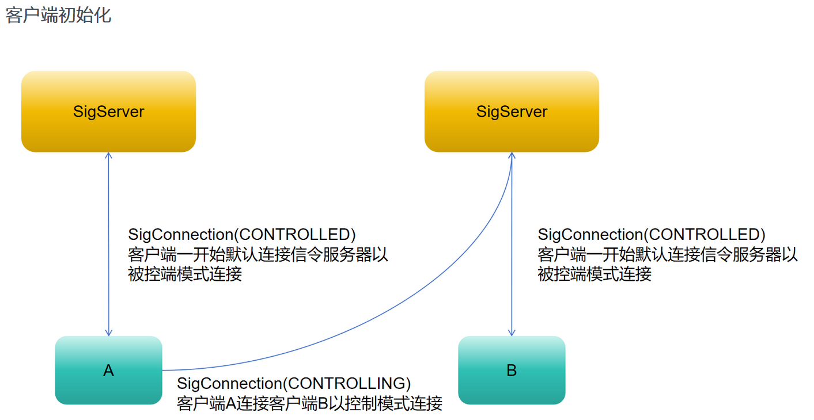
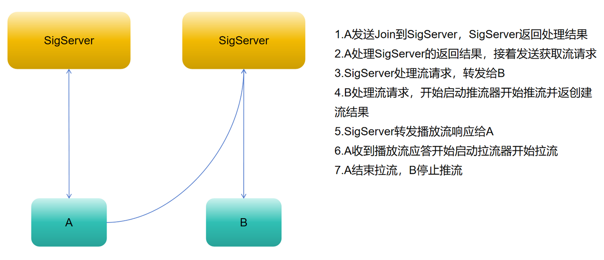

好的，这是一个非常核心的问题。底层对鼠标和键盘事件的传递与模拟，是整个远程控制功能实现的关键。它主要分为两大步骤：**在控制端捕获并传递**，以及**在被控端接收并模拟**。

从您提供的代码（客户端 SigConnection.cpp）中，我们可以清晰地看到**第二步：接收与模拟**的实现。

---

### 1. 传递：从控制端到被控端

虽然这部分代码没有直接提供，但我们可以根据被控端的接收逻辑推断出控制端的工作流程：

1.  **事件捕获 (Event Capture)**：
    *   控制端的应用程序（UI部分）会监听本地的鼠标和键盘事件。例如，当用户在视频渲染窗口 (`OpenGLRender`) 上移动鼠标或按下键盘时，Qt的事件系统会捕获到这些动作。

2.  **数据封装 (Data Encapsulation)**：
    *   捕获到的事件不能直接发送，需要被转换成一种标准化的、跨网络传输的格式。这就是项目中定义的各种 `_Body` 结构体的作用。
    *   **键盘事件**: 捕获按键的**虚拟键码 (Virtual-Key Code)** 和**动作类型（按下/释放）**，打包成一个 `Key_Body` 结构体。
    *   **鼠标点击**: 捕获**哪个按键（左/中/右）**和**动作类型（按下/释放）**，打包成一个 `Mouse_Body` 结构体。
    *   **鼠标移动**: 为了解决控制端和被控端分辨率不同的问题，这里采用了一个非常巧妙的方法：**不发送绝对坐标，而是发送坐标比例**。控制端计算出鼠标位置相对于其视频窗口的 X、Y 比例（0.0 到 1.0 之间），然后将这个比例打包成 `MouseMove_Body` 结构体发送。
    *   **鼠标滚轮**: 捕获滚轮滚动的**方向和幅度**，打包成 `Wheel_Body` 结构体。

3.  **网络发送 (Network Sending)**：
    *   控制端的 `SigConnection` 将封装好的结构体通过 TCP 连接发送给信令服务器。
    *   信令服务器根据连接关系，将这个数据包**原封不动地转发**给对应的被控端。

---

### 2. 模拟：在被控端重现事件

这部分就是您提供的代码所展示的核心逻辑。当被控端的 `SigConnection` 从网络缓冲区收到数据后：

1.  **接收与解析 (Reception & Parsing)**：
    *   [`HandleMessage`]SigConnection.cpp ) 函数根据消息头中的 `cmd` 字段，将数据包分发给对应的 `do...Event` 处理函数。

2.  **核心技术：使用 Windows API 模拟输入**：
    *   被控端使用 Windows 提供的底层 API 来将接收到的数据“注入”到操作系统中，让系统以为这些事件是由真实的物理设备产生的。
    *   最核心的函数是 **`SendInput`**。这是一个非常强大的 API，可以精确地模拟各种输入事件。

3.  **具体实现**：

    *   **键盘事件 (`doKeyEvent`)**:
        ```cpp
        // filepath: e:\cppprofile\ENET Demo\ECloudAssistant\Net\SigConnection.cpp
        // ...existing code...
        INPUT input[1];
        // ...
        input[0].type = INPUT_KEYBOARD;
        input[0].ki.wVk = vk; // 设置虚拟键码
        input[0].ki.dwFlags = op; // 设置是按下(0)还是抬起(KEYEVENTF_KEYUP)
        // ...
        SendInput(1,input,sizeof(input)); // 发送键盘输入事件
        // ...existing code...
        ```
        它构造一个 `INPUT_KEYBOARD` 类型的 `INPUT` 结构体，填入从网络包中解析出的虚拟键码和动作，然后调用 `SendInput` 来模拟一次按键。

    *   **鼠标点击 (`doMouseEvent`)**:
        ```cpp
        // filepath: e:\cppprofile\ENET Demo\ECloudAssistant\Net\SigConnection.cpp
        // ...existing code...
        dwFlags |= (body->mouseButtons & MouseType::LeftButton) ? MOUSEEVENTF_LEFTDOWN : 0;
        // ...
        input.type = INPUT_MOUSE;
        input.mi.dwFlags = dwFlags; // 设置鼠标动作，如 MOUSEEVENTF_LEFTDOWN
        SendInput(1,&input,sizeof(input)); // 发送鼠标输入事件
        // ...existing code...
        ```
        它通过组合 `MOUSEEVENTF_*` 标志位来精确描述是哪个按键被按下或释放，然后同样用 `SendInput` 来执行。

    *   **鼠标滚轮 (`doWheelEvent`)**:
        ```cpp
        // filepath: e:\cppprofile\ENET Demo\ECloudAssistant\Net\SigConnection.cpp
        // ...existing code...
        input.mi.dwFlags = MOUSEEVENTF_WHEEL;
        input.mi.mouseData = body->wheel * 240; // 设置滚动方向和幅度
        SendInput(1,&input,sizeof(input));
        // ...existing code...
        ```
        它使用 `MOUSEEVENTF_WHEEL` 标志和 `mouseData` 字段来模拟滚轮滚动。

    *   **鼠标移动 (`doMouseMoveEvent`)**:
        ```cpp
        // filepath: e:\cppprofile\ENET Demo\ECloudAssistant\Net\SigConnection.cpp
        // ...existing code...
        // 将比例乘以本地屏幕的尺寸，得到本地的绝对坐标
        int x = static_cast<int>(combined_x * screen_->size().width() / screen_->devicePixelRatio());
        int y = static_...
        // 使用Qt的QCursor设置鼠标位置
        QCursor::setPos(x,y);
        // ...existing code...
        ```
        对于鼠标移动，这里使用了更上层的 Qt 函数 `QCursor::setPos()`。它首先将接收到的**坐标比例**乘以**本地屏幕的实际分辨率**，计算出应该移动到的绝对坐标，然后直接设置光标位置。这种方法对于绝对定位非常方便。

### 总结

| 事件类型 | 传递的信息 | 模拟技术 (在被控端) |
| :--- | :--- | :--- |
| **键盘** | 虚拟键码 (VK Code) + 按下/释放 | `SendInput` + `INPUT_KEYBOARD` |
| **鼠标点击** | 哪个按键 + 按下/释放 | `SendInput` + `INPUT_MOUSE` + `MOUSEEVENTF_*DOWN/UP` |
| **鼠标移动** | **坐标比例 (X, Y)** | `QCursor::setPos()` (内部可能调用 `SetCursorPos` API) |
| **鼠标滚轮** | 滚动方向和幅度 | `SendInput` + `INPUT_MOUSE` + `MOUSEEVENTF_WHEEL` |

通过这套“**捕获 → 封装 → 传递 → 解析 → 模拟**”的流程，项目成功地将控制端的用户操作，以一种高效且与分辨率无关的方式，在被控端的电脑上精确地重现了出来。


好的，我们来详细描述客户端 `SigConnection` 的完整工作流程。这个类是客户端的“网络大脑”，负责与信令服务器的所有交互，并根据服务器的指令驱动本地的推流、拉流和远程控制模拟。

整个流程可以根据客户端的角色（**被控端**或**控制端**）分为两条主线，但它们都始于同一个起点。

---

### 1. 阶段一：初始化与加入房间

这是所有客户端的共同起点。

1.  **构造与连接 (`SigConnection::SigConnection`)**:
    *   当一个 `SigConnection` 对象被创建时，它已经收到了一个建立好的 TCP 套接字 (`sockfd`)。
    *   它立即设置两个关键的**回调函数**：
        *   `SetReadCallback`: 将底层的读事件绑定到本类的 `OnRead` 方法。从此，只要网络上有数据到达，`OnRead` 就会被调用。
        *   `SetCloseCallback`: 将底层的断开连接事件绑定到 `OnClose` 方法。
    *   它会获取本地主屏幕的信息 (`screen_`)，为后续模拟鼠标移动做准备。
    *   最关键的一步：构造函数最后会立即调用 `Join()`，主动向服务器发送**加入房间**的请求，并附上自己的识别码 (`code_`)。

2.  **接收服务器响应 (`doJoin`)**:
    *   服务器收到 `Join` 请求后，会回复一个 `JoinReply` 消息。
    *   客户端的 `OnRead` -> `HandleMessage` 流程会解析这个消息，并调用 `doJoin` 函数。
    *   在 `doJoin` 中，如果服务器回复成功 (`S_OK`)，客户端的状态从 `NONE` 变为 `IDLE`（空闲）。

    **此时，两条逻辑主线开始分化。**

---

### 2. 阶段二：作为被控端 (Pusher) 的流程

1.  **进入空闲等待**:
    *   `doJoin` 执行完毕后，被控端进入 `IDLE` 状态，静静地等待服务器的指令。

2.  **接收创建流指令 (`doCtreatStream`)**:
    *   当一个控制端想要连接它时，服务器会给它发送一个 `CREATESTREAM` 指令。
    *   `HandleMessage` 将此指令分发给 `doCtreatStream`。
    *   `doCtreatStream` 函数执行以下操作：
        *   生成一个唯一的 RTMP 推流地址（例如 `rtmp://.../live/1`）。
        *   调用上层注册的 `startStreamCb_` **回调函数**，将这个地址传递给 `RtmpPushManager`，命令它开始推流。
        *   如果 `RtmpPushManager` 启动成功，它就将这个推流地址和成功状态回复给服务器。
        *   自身状态从 `IDLE` 变为 `PUSHER`（正在推流）。

3.  **接收并模拟远程控制事件**:
    *   一旦进入 `PUSHER` 状态，它就开始接收来自服务器转发的各种控制事件。
    *   `HandleMessage` 会根据消息类型调用不同的 `do...Event` 函数：
        *   **`doMouseEvent`**: 接收鼠标点击事件，解析是哪个按键（左/中/右）以及动作（按下/释放），然后调用 Windows API **`SendInput`** 在本地模拟一次真实的鼠标点击。
        *   **`doKeyEvent`**: 接收键盘事件，解析虚拟键码和动作，同样使用 **`SendInput`** 模拟一次按键。
        *   **`doWheelEvent`**: 接收滚轮事件，使用 **`SendInput`** 模拟滚轮滚动。
        *   **`doMouseMoveEvent`**: 接收鼠标移动事件。这里的设计非常巧妙：它接收到的是一个**坐标比例**（0.0 到 1.0）。它用这个比例乘以**本地屏幕的实际分辨率**，计算出准确的绝对坐标，然后调用 `QCursor::setPos()` 将鼠标光标移动到该位置。这完美解决了控制端和被控端分辨率不同的问题。

4.  **停止推流 (`doDeleteStream`)**:
    *   如果所有控制端都断开了连接，服务器会发来一个 `DELETESTREAM` 指令。
    *   `doDeleteStream` 会调用 `stopStreamCb_` 回调函数，通知 `RtmpPushManager` 停止推流。

---

### 3. 阶段二：作为控制端 (Puller) 的流程

1.  **主动请求拉流 (`obtainStream`)**:
    *   在 `doJoin` 函数中，当客户端发现自己的类型是 `CONTROLLING` 时，它在进入 `IDLE` 状态后，会**立即调用 `obtainStream()`**。
    *   `obtainStream()` 向服务器发送一个获取流的请求，并附上它想要连接的被控端的 `code_`。
    *   发送请求后，状态立即从 `IDLE` 变为 `PULLER`（等待拉流）。

2.  **接收流地址并开始播放 (`doPlayStream`)**:
    *   服务器在协调被控端成功推流后，会将推流地址通过 `PLAYSTREAM` 指令发回给这个控制端。
    *   `HandleMessage` 将指令分发给 `doPlayStream`。
    *   `doPlayStream` 从消息中提取出 RTMP 流地址。
    *   它调用 `startStreamCb_` **回调函数**，将流地址传递给 `AVDEMuxer` 和 `OpenGLRender` 等拉流和渲染模块，开始播放远程桌面。

3.  **发送控制事件 (隐含流程)**:
    *   这部分逻辑在 `SigConnection` 之外，通常在 UI 层（如 `OpenGLRender`）。
    *   UI 窗口会捕获本地的鼠标键盘事件。
    *   它会将这些事件封装成 `Mouse_Body`, `Key_Body` 等标准结构体。
    *   然后调用 `SigConnection` 的 `Send()` 方法，将这些事件数据包发送给服务器，由服务器转发给被控端。

---

### 4. 核心机制总结

*   **状态机**: `SigConnection` 内部通过 `State` 枚举（`NONE`, `IDLE`, `PULLER`, `PUSHER`）来管理自身在不同阶段的行为，确保在正确的状态下执行正确的操作。
*   **消息驱动**: 整个流程由网络消息驱动。`HandleMessage` 像一个交通警察，根据不同的消息 `cmd`，将任务分发给不同的处理函数。
*   **回调解耦**: 通过 `startStreamCb_` 和 `stopStreamCb_`，`SigConnection` 将网络信令逻辑与具体的媒体处理逻辑（推流、拉流）完全分离开。它只负责“发号施令”，而不关心具体怎么实现。
*   **API模拟**: 在被控端，它通过调用 `SendInput` 和 `QCursor::setPos` 等系统级 API，将网络数据包“翻译”成了操作系统能够理解的真实用户输入，从而实现了远程控制。

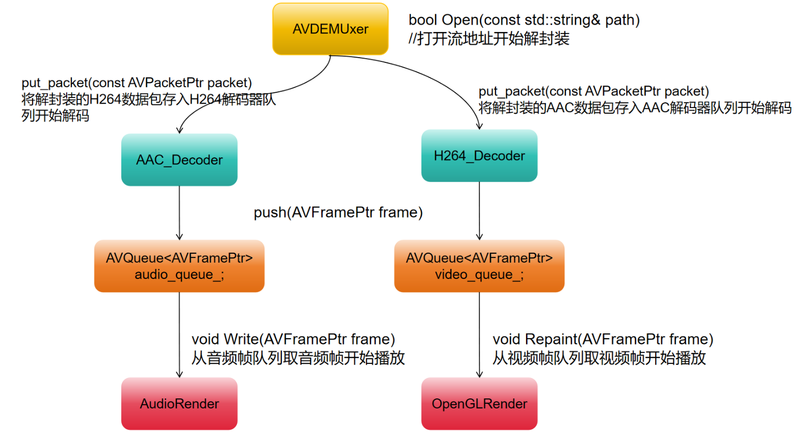

## AVPlayer
好的，我们来详细叙述 `AVPlayer` 的完整工作流程。`AVPlayer` 是整个远程控制客户端（拉流端）的**总指挥官**，它巧妙地将**信令通信、音视频处理、多线程播放、界面渲染**和**用户输入转发**这五大核心功能整合在了一起。

整个流程可以分为以下几个关键阶段：

---

### 1. 阶段一：初始化与连接

这是 `AVPlayer` 启动后的第一步，目标是与信令服务器建立联系。

1.  **构造与初始化 (`AVPlayer::AVPlayer`, `AVPlayer::Init`)**:
    *   当 `AVPlayer` 窗口被创建时，它的构造函数会立即调用 `Init()` 方法。
    *   `Init()` 负责准备好所有必要的“工具”：
        *   创建 `AVContext`：这是一个数据中心，包含了音视频解码器和用于线程间通信的队列。
        *   创建 `AVDEMuxer`：这是解封装器，后续将负责从网络流中拉取数据并分离出音视频。
        *   初始化 `AudioRender`：准备好本地的音频播放设备。
        *   连接信号槽：`connect(this, &AVPlayer::sig_repaint, ...)`，这是实现线程安全渲染的关键。它将子线程的重绘请求信号 `sig_repaint` 连接到主线程的 `Repaint` 槽函数。

2.  **发起连接 (`AVPlayer::Connect`)**:
    *   用户在界面上输入连接码后，UI会调用 `Connect(ip, port, code)`。
    *   `Connect` 方法创建一个 `SigConnection` 对象 (`sig_conn_`)，这是与信令服务器沟通的唯一通道。
    *   **注册回调**：它将自己的两个成员函数 `HandleStartStream` 和 `HandleStopStream` 作为回调函数注册到 `sig_conn_` 中。这是一种解耦设计，`sig_conn_` 只管收发消息，具体业务由 `AVPlayer` 的回调来处理。
    *   `sig_conn_` 最终向服务器发起连接并发送包含连接码的 `JOIN` 请求。

---

### 2. 阶段二：启动流处理

当服务器确认连接并协调好被控端后，真正的音视频处理流程开始。

1.  **接收开流指令 (`AVPlayer::HandleStartStream`)**:
    *   信令服务器向 `sig_conn_` 发送一条 `PLAYSTREAM` 指令，其中包含了被控端生成的 RTMP 推流地址。
    *   `sig_conn_` 收到指令后，自动调用之前注册的 `HandleStartStream` 回调函数，并将流地址传递进来。

2.  **启动解封装与解码**:
    *   `HandleStartStream` 立即命令 `avDEMuxer_` 打开 (`Open`) 这个流地址。
    *   `avDEMuxer_` 内部会启动一个线程，开始从 RTMP 服务器拉取数据，将其解封装成压缩的视频包（H.264）和音频包（AAC），然后分别放入 `AVContext` 的解码前队列中。
    *   `AVContext` 内部的解码器会从队列中取出数据包进行解码，再将解码后的原始数据（YUV 视频帧和 PCM 音频帧）放入解码后队列。

3.  **启动播放线程**:
    *   在 `HandleStartStream` 中，`AVPlayer` 创建并启动两个独立的播放线程：
        *   `videoThread_`：负责运行 `videoPlay()` 方法。
        *   `audioThread_`：负责运行 `audioPlay()` 方法。

---

### 3. 阶段三：音视频并发播放

两个播放线程各司其职，并行工作。

1.  **视频播放 (`AVPlayer::videoPlay`)**:
    *   `videoThread_` 在一个循环中不断地从 `AVContext` 的**视频解码后队列**中尝试取出 YUV 视频帧。
    *   取出帧后，它**并不直接渲染**（因为这会违反UI操作只能在主线程的原则），而是通过 `emit sig_repaint(frame)` 发出一个信号。
    *   这个信号被 Qt 的事件系统捕获，并安全地调度到**主UI线程**去执行 `OpenGLRender::Repaint` 槽函数，最终利用 GPU 将画面渲染到屏幕上。

2.  **音频播放 (`AVPlayer::audioPlay`)**:
    *   `audioThread_` 在循环中从 `AVContext` 的**音频解码后队列**中取出 PCM 音频帧。
    *   它直接调用 `AudioRender::Write()` 方法，将原始音频数据写入底层的音频设备缓冲区进行播放。音频 API 通常是线程安全的，所以可以直接在子线程调用。

---

### 4. 阶段四：远程控制事件转发

在播放音视频的同时，`AVPlayer` 也在监听用户的操作。

1.  **事件捕获**:
    *   `AVPlayer` 重写了 Qt 的一系列事件处理函数，如 `mouseMoveEvent`, `keyPressEvent`, `wheelEvent` 等。
    *   当用户的鼠标在 `AVPlayer` 窗口上移动、点击或滚动，或者按下键盘时，对应的事件处理函数就会被触发。

2.  **数据打包与发送**:
    *   在这些事件函数内部，程序会从事件对象中提取关键信息（如坐标、按键码、滚轮方向）。
    *   然后调用 `sig_conn_` 的相应方法（如 `SendMoustMoveEvent`），将这些信息打包成预定义的网络格式。
    *   `sig_conn_` 将数据包通过 TCP 连接发送给信令服务器，服务器再将其转发给被控端，被控端收到后模拟出相应的操作。

---

### 5. 阶段五：关闭与资源回收

当用户关闭窗口或连接断开时，必须优雅地释放所有资源。

1.  **触发关闭 (`AVPlayer::Close`)**:
    *   `Close()` 方法被调用（可以由析构函数或 `HandleStopStream` 回调触发）。
    *   它首先将 `stop_` 标志位置为 `true`，这是一个信号，通知 `audioPlay` 和 `videoPlay` 线程的循环应该退出了。
    *   **等待线程结束**: 调用 `audioThread_->join()` 和 `videoThread_->join()`，确保两个子线程完全执行完毕后才继续，防止资源竞争和程序崩溃。
    *   **释放资源**: 依次停止音频设备、断开网络连接、删除 `AVContext`、重置 `AVDEMuxer` 等，确保没有内存或句柄泄漏。

通过这一整套设计，`AVPlayer` 实现了一个健壮、高效、解耦良好的远程桌面客户端。