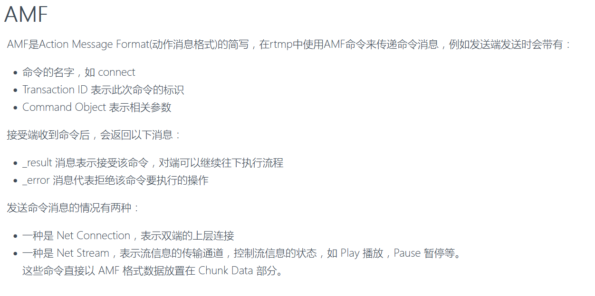
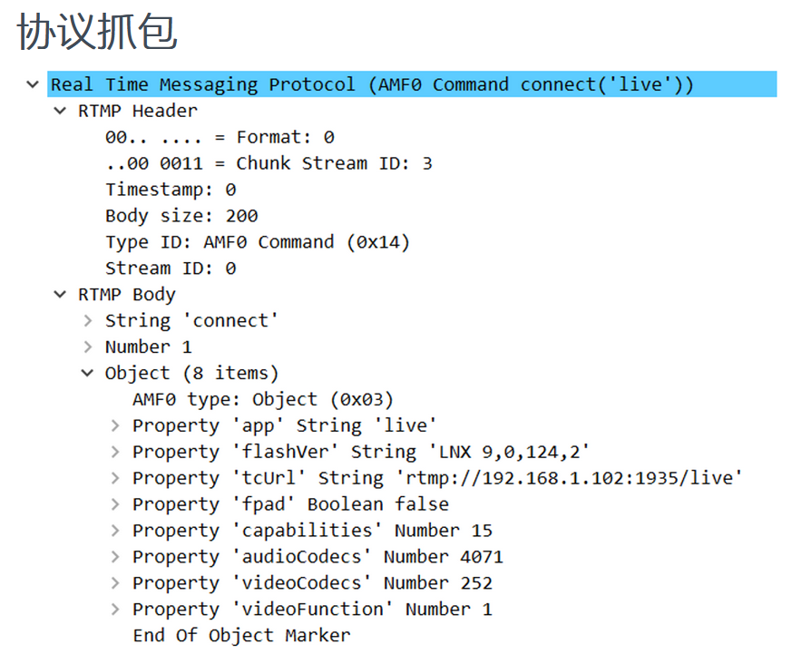
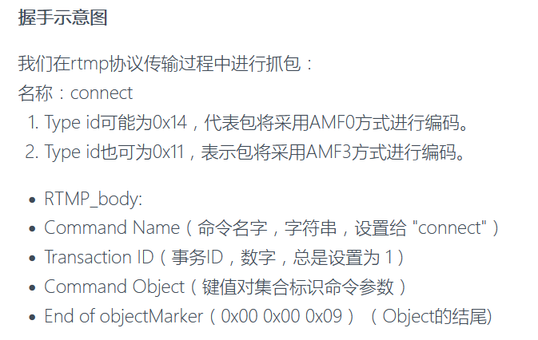
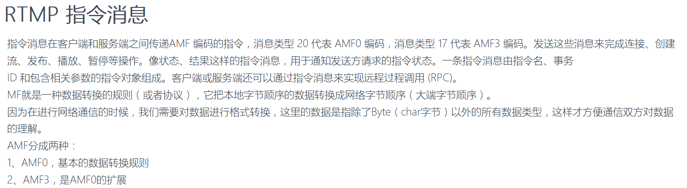

在 RTMP 中把一条完整消息拆分成多个 chunk 发送，然后在接收端再把它们组装回完整消息，有以下几个好处：

1. 流式传输与低延迟  
   - 将大消息分块发送后，接收端可以在收到第一个 chunk 后就开始处理／转发，减少端到端延迟。  
   - 而无需等所有数据都到齐才能开始解码或播放。

2. 消息多路复用和交错  
   - 不同的 message stream（音视频、控制消息等）可以交错地发送在同一个 TCP 连接上。  
   - chunk size 决定了每次发送／接收的最小单位，能避免长时间占用带宽导致其他流“饿死”。

3. 流量控制与差异化头部开销  
   - 只有第一个 chunk 要带完整的 11 字节 message header，后续 chunk 用 fmt=3 可只传 Basic Header，节省带宽。  
   - 可以动态调整 chunk 大小来控制带宽与吞吐。

4. 兼容网络 MTU 与缓冲  
   - 网络层（TCP/IP）对最大报文长度（MTU）有限制，分块能避免大包被底层拆分或丢弃。  
   - 客户端／服务器也更容易管理固定大小的缓冲区。

5. 协议设计要求  
   - RTMP 协议规范里就定义了 chunk 流的概念，分块＋组包是协议互通的前提。  

总体来说，拆分／组包机制既满足了对大消息的可靠传输，又兼顾了低延迟、多路复用和带宽利用率，是 RTMP 在实时流媒体场景下的重要设计。

RtmpChunk.h 和 RtmpChunk.cpp 主要负责 RTMP 协议里 “chunk” 级别的数据收发与组装：  

· RtmpChunk.h  
  - 定义了 RtmpChunk 类的接口，包含：  
    • Parse(...)：把从网络读来的分片（chunk）拼装成完整的 RtmpMessage  
    • CreateChunk(...)：把一个完整的 RtmpMessage 拆分成多个符合指定大小的 chunk  
    • Basic/Header/Body 三阶段的私有方法原型  
    • chunk stream（CSID）、message stream（MSID）与 chunk 大小等配置项  
    • 存储正在组装的各路消息（map<csid, RtmpMessage>）  
  - 通过枚举与常量（KChunkMessageHeaderLenght）表达 RTMP 中 4 种 fmt （0–3）对应的 Message Header 长度  

· RtmpChunk.cpp  
  - 实现了 RtmpChunk 中的所有逻辑：  
    1. ParseChunkHeader()  
       · 解析 Basic Header（取高 2 位得 fmt、低 6 位／扩展字节得 CSID）  
       · 根据 fmt 读取 11/7/3/0 字节的 Message Header，提取 timestamp、length、type_id、stream_id  
       · 处理 “24 位满溢” 后的 Extended Timestamp  
       · 更新或创建对应 csid 的 RtmpMessage  
    2. ParseChunkBody()  
       · 根据 in_chunk_size 限制，从网络缓冲拷贝数据到 RtmpMessage.playload  
       · 累加 index，满一个 chunk 或读完消息时切回解析 Header  
    3. CreateBasicHeader() / CreateMessageHeader()  
       · 按 fmt 生成 Basic/Header 字段：封装 timestamp、length、type_id、stream_id、小端／大端序  
    4. CreateChunk()  
       · 首个 chunk 用 fmt=0 全字段，后续剩余 payload 用 fmt=3 复用 header  
       · 根据 out_chunk_size 拆分 payload，并必要时插入 Extended Timestamp  

整体上，它们实现了 RTMP 的“分片—组包”双向流程：一端把大消息切成小 chunk 发出，另一端按 CSID 路由、按 fmt 还原出完整的 RtmpMessage，绑定消息流（MSID）后上层解码或应用。

下面再细化「拆分→发送」和「接收→组包」两个流程在代码里的具体步骤。  

1. 拆分并发送（CreateChunk）  
   - 计算最坏情况缓冲区大小：payload + 每个 chunk 可能的 4 字节扩展 TS + BasicHeader  
   - 写第一个 chunk：  
     1) 调用 CreateBasicHeader(fmt=0, csid, …) 写 Basic Header（包含 fmt=0）；  
     2) 调用 CreateMessageHeader(fmt=0, in_msg, …) 写完整的 Message Header（11 字节）；  
     3) 如果 `_timestamp ≥ 0xFFFFFF`，写 4 字节扩展时间戳；  
     4) memcpy 首个 chunk 的 payload（不超过 out_chunk_size_）。  
   - 写后续 chunk：  
     while 剩余 payload > 0：  
     • memcpy 下一段 payload（长度 = out_chunk_size_ 或剩余）；  
     • 调用 CreateBasicHeader(fmt=3, csid, …) 写 Basic Header（fmt=3，无 Message Header）；  
     • 如有必要，写扩展时间戳。  
   - 最终返回写入的总字节数。  

2. 接收并组包（Parse → ParseChunkHeader + ParseChunkBody）  
   - 状态机：先 PARSE_HEADER 再 PARSE_BODY，body→header→body…  
   - ParseChunkHeader：  
     1) peek 缓冲区，读第 1 字节 flags，`fmt = flags>>6`（高 2 位），`csid = flags&0x3F`；  
     2) 如 csid=0/1/… 扩展为 1/2/3 字节形式；  
     3) 根据 fmt 在 KChunkMessageHeaderLenght[fmt] 里拿到 Message Header 长度（11/7/3/0）；  
     4) memcpy 到本地 RtmpMessageHeader，然后：  
        - fmt≤1：读取 3 字节消息长度＋1 字节 type_id；分配或重用 payload 缓冲  
        - fmt=0：再读取 4 字节 stream_id  
     5) 解析 3 字节 timestamp；如果 timestamp=0xFFFFFF 或上次也满量，则再读 4 字节扩展 ts；  
     6) 初始化或累加 rtmp_msg.timestamp/extend_timestamp；切到 PARSE_BODY。  
   - ParseChunkBody：  
     1) 计算本次要拷贝的 payload 长度 `to_copy = min(剩余, in_chunk_size_)`；  
     2) memcpy 到 rtmp_msg.playload+index，更新 index；  
     3) 如果正好读满一个 chunk （index % in_chunk_size_==0）或读完 message，就切回 PARSE_HEADER；  
     4) 如果 index == lenght，说明完整消息到了，输出 out_rtmp_msg，并清理状态。  

通过这两部分配合，实现了——  
  • 发送端把大消息切成多个小 chunk（头+body）发出；  
  • 接收端按 csid 和 fmt 还原出每个 chunk 的头信息，把 payload 拼回去，最终得到一条完整的 RtmpMessage。

AMF（Action Message Format）是 Flash/RTMP 生态里用于在二进制流中序列化／反序列化“脚本级”数据（类似 JSON 的对象、字符串、数字、布尔等）的标准格式。在 RTMP 协议里，所有的“命令（RPC）报文”与“元数据（Metadata）报文”都以 AMF0（或 AMF3）编码放在 RTMP 消息体里。

– 在 RTMP 流程中，AMF 编解码发生在“握手（Handshake）”结束、进入“Chunk 解包／组包”之后、在“Message 层”对消息体Body进行处理的阶段。
– RTMP 收到一个 Chunk 后，先重组成完整的 Message，解析出 MessageTypeID；
• 如果 MessageTypeID 是 0x14（20，AMF0 Command Message）或 0x12（18，AMF0 Data Message），则把它的 payload 交给 AmfDecoder 来解析命令名（string）、事务 ID（number）、命令对象（object）或其他参数；
– 反之，当服务器要发送 connect/play/publish/onMetaData 等指令或元信息时，就在 Message 构造阶段用 AmfEncoder 将内存里的 key-value 对象、字符串和数字编码成 AMF0 二进制，然后再封装成 RTMP Message → Chunk → TCP 发出。

简而言之，AMF 编解码是 RTMP 在应用层“命令+元数据”与底层网络字节流之间的桥梁，专门用来序列化／反序列化脚本级的数据结构。

AMF（Action Message Format）是在 RTMP 协议里对 Flash/JS 对象和基本类型（Number、Boolean、String、Object、ECMA Array 等）做二进制序列化的标准格式。引入 AMF 编解码的意义主要包括：

1. 互操作性  
   · RTMP 客户端／服务端（通常是 Flash 或 H5 播放器）都按 AMF 规范组织命令和元数据，统一的编解码保证双方能正确互换参数。  

2. 动态类型支持  
   · AMF0 能序列化任意嵌套的键值对（类似 JSON 的对象、关联数组），方便传输复杂的命令或元信息。  

3. 二进制高效  
   · 与文本 JSON 相比，AMF 是紧凑的二进制格式，能减少网络带宽占用、加快解析速度。  

4. 解耦网络与业务  
   · 上层业务只关注 AmfObject/AmfObjects 这种内存结构，底层由 `AmfEncoder`／`AmfDecoder` 统一完成字节流和内存对象的映射。  

总之，AMF 编解码是 RTMP 消息命令、参数和元数据在网络传输和本地内存表示之间的桥梁，保证了协议的兼容性、灵活性和性能。

下面结合 `AmfDecoder` 和 `AmfEncoder` 的实现，梳理 AMF0（Action Message Format 0）的完整编解码流程。

---

## 一、解码流程（AmfDecoder）

1. **入口 `decode(const char* data, int size, int n)`**  
   - 循环读取字节流，直到消耗完 `size` 字节或达到条目上限 `n`。  
   - 每次循环：  
     a. 取出 1 字节类型标记 `type`（`AMF0_NUMBER/BOOLEAN/STRING/OBJECT/ECMA_ARRAY/...`）  
     b. 根据 `type` 调用对应的私有静态方法：  
        - `decodeNumber`（8 字节 IEEE-754）  
        - `decodeBoolean`（1 字节布尔）  
        - `decodeString`（2 字节长度 + 内容）  
        - `decodeObject`（对象或 ECMA Array）  
     c. 将解析出的值填入内部成员 `m_obj`（单值）或 `m_objs`（键值对集合）  
     d. 累加已消费字节数，直到返回值 ≤0（错误或数据不够）或达到条目数上限。

2. **基本类型解析**  
   - `decodeNumber`：按大端顺序反转 8 字节到 `double`  
   - `decodeBoolean`：0→false，非 0→true  
   - `decodeString`：先用 `decodeInt16` 读长度，再读字符串内容  

3. **复合类型解析**  
   - `decodeObject`：  
     - 清空 `m_objs`，循环读取键名（`decodeInt16`+字符串）  
     - 为每个键创建一个子 `AmfDecoder`，调用 `decode(…,1)` 解析单个值  
     - 直到遇到空键 + `AMF0_OBJECT_END` 标记结束  

4. **获取结果**  
   - 解码完成后，通过 `getObject()` 或 `getObjects()` 拿到最后一项或整个键值集合。

---

## 二、编码流程（AmfEncoder）

1. **构造与缓冲管理**  
   - 构造时预分配一块 `m_size` 大小的缓冲 `m_data`，写入指针 `m_index = 0`  
   - 各 `encodeX` 方法前检查剩余空间，不够则调用 `realloc(newSize)` 扩容并复制旧数据。

2. **基本类型序列化**  
   - `encodeNumber(double)`：写入 1 字节标记 `AMF0_NUMBER` + 8 字节大端 IEEE-754  
   - `encodeBoolean(int)`：写入标记 `AMF0_BOOLEAN` + 1 字节布尔值  
   - `encodeString(const char*,len, isObject)`：  
     - 短字符串（len<65536）写 `AMF0_STRING` + 2 字节长度 + 内容  
     - 长字符串写 `AMF0_LONG_STRING` + 4 字节长度 + 内容  

3. **复合类型序列化**  
   - `encodeObjects(AmfObjects&)`：  
     1. 空对象写 `AMF0_NULL` 并返回  
     2. 写 `AMF0_OBJECT`  
     3. 遍历 `objs`：先 `encodeString(key,false)`，再按值类型调用 `encodeNumber/encodeString/encodeBoolean`  
     4. 写空键（`encodeString("",0,false)`）+ `AMF0_OBJECT_END` 结束  
   - `encodeECMA(AmfObjects&)`：流程同上，但开头写 `AMF0_ECMA_ARRAY` + 4 字节元素数（可写 0）  

4. **输出**  
   - 调用方通过 `data()` 拿到底层缓冲（`shared_ptr<char>`），通过 `size()` 得到有效长度，再发送或存储。

---

整体上，AMF0 编解码集中在：

- “先写／读一个类型标记”  
- “根据标记走固定长度或可变长度的读写逻辑”  
- “复合类型则嵌套调用自己”  
- “编码端随时检查并扩容；解码端按需提前检测数据是否足够”

这种设计既保证了对 RTMP 消息中命令和元数据的灵活处理，也能较高效地在内存和网络字节流之间互转。