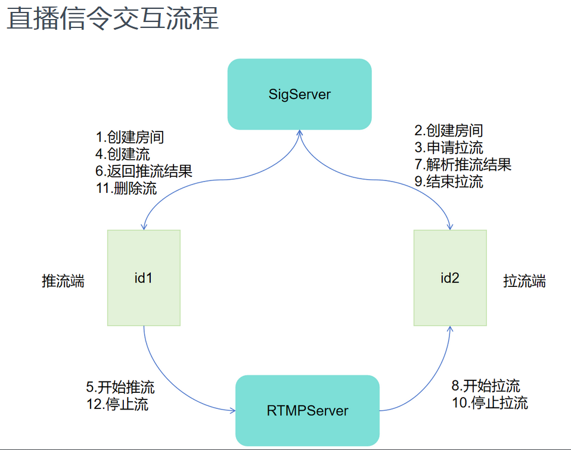
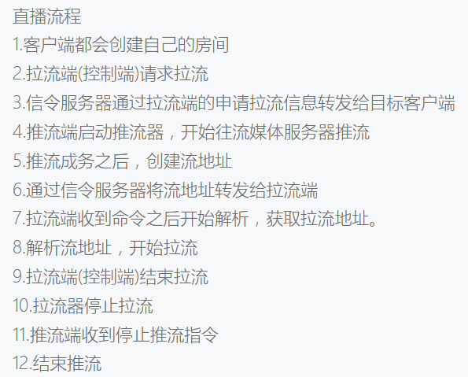

define.h 定义信令服务器使用的命令、结果码、客户端状态及通信数据包结构。
本文件用于客户端与服务器之间的信令交互，支持房间创建、获取流、播放/停止流
以及键鼠控制等功能。

ConnectionManager 是信令服务器中用于管理所有客户端 TCP 连接的单例类。它的主要职责有：

- 以唯一字符串 ID 作为键，维护一个 std::unordered_map<std::string, TcpConnection::Ptr>，用于存储和查找客户端连接。  
- 通过 std::mutex 保证多线程环境下对连接列表的安全访问。  
- 提供以下核心方法：  
  - GetInstance()：线程安全地创建并返回唯一实例。  
  - AddConn(id, conn)：注册一个新的连接。  
  - RmvConn(id)：移除指定连接。  
  - QueryConn(id)：按 ID 查找并返回对应的连接。  
  - Size()：返回当前管理的连接总数。  
  - Close()：清空所有连接，释放资源。  

采用单例模式可以保证全局只有一个连接管理器实例，方便统一调度和资源回收。


ConnectionManager 的单例模式主要通过以下几步来保证“全局唯一、线程安全”：

1. 私有化构造函数  
   - 构造函数 `ConnectionManager()` 和析构函数被声明为 private／protected，外部无法直接 new 实例。  

2. 静态唯一实例指针  
   - 在类内部声明unique_ptr：  
     ```cpp
     static std::unique_ptr<ConnectionManager> instance_; 
     ```  
   - 初始值设为 `nullptr`，只有通过内部逻辑才能创建它。  

3. 线程安全的一次性初始化  
   - 在 `GetInstance()` 中使用了 `std::call_once` 和 `std::once_flag`：  
     ````cpp
     // filepath: e:\cppprofile\ENET\SigServer\ConnectionManager.cpp
     ConnectionManager* ConnectionManager::GetInstance()
     {
         static std::once_flag flag;
         std::call_once(flag, [&](){
             instance_.reset(new ConnectionManager());
         });
         return instance_.get();
     }
     ````  
   - `std::call_once` 确保传入的 lambda 只会被执行一次，不管多少线程同时调用 `GetInstance()`。  

4. 全局访问点  
   - 通过 `ConnectionManager::GetInstance()` 返回同一个实例指针，外部只能通过它来使用管理器。  

这样，就在保证“只能创建一个实例”的同时，也利用 C++11 的 `std::call_once` 实现了多线程环境下的安全初始化。


SigConnection 是信令服务器中负责单个客户端会话管理与消息转发的核心类，其作用可概括为：

1. 客户端状态机管理  
   - NONE：初始状态，尚未加入任何“房间”  
   - IDLE：已加入房间但未推流也未拉流  
   - PUSHER：处于推流状态，接受控制端创建／播放流请求  
   - PULLER：处于拉流状态，向推流端转发鼠标／键盘控制消息  
   - CLOSE：连接已断开  

2. 信令协议解析与分发  
   - OnRead 循环从底层缓冲读取完整包（packet_head + body）  
   - 根据 `cmd` 字段分发到：  
     • HandleJion（JOIN）——加入或创建房间  
     • HandleObtainStream（OBTAINSTREAM）——协商拉／推流关系  
     • HandleCreateStream（CREATESTREAM）——推流端接收创建流结果并通知拉流端开始播放  
     • HandleDeleteStream（DELETESTREAM）——停止流/清理状态  
     • HandleOtherMessage（MOUSE／KEY／WHEEL 等）——将控制消息转发给关联的推流端  

3. “房间”与关联列表维护  
   - 加入房间后，ConnectionManager 以 `code_`（房间ID）注册当前连接  
   - objectes_ 列表保存所有与本连接相关联的对端 ID  
     • PULLER 状态时保存推流端 ID，以便转发鼠标／键盘事件  
     • PUSHER 状态时保存所有拉流端 ID，创建流成功后广播流地址  

4. 拉流／推流协商流程  
   - DoObtainStream：拉流端发起 OBTAINSTREAM，  
     • 目标是 IDLE → 通知目标 CREATESTREAM，自己转为 PULLER  
     • 目标是 PUSHER → 直接返回流地址进入播放  
   - DoCreateStream：推流端接收 CREATESTREAM_REPLY，保存流地址后遍历所有 PULLER，向它们发送 PLAYSTREAM 包体  

5. 断开及清理  
   - DisConnected/​Clear：移除自身在 ConnectionManager 的注册，遍历 objectes_ 通知所有对端更新流数量或停止播放，重置状态  

通过上述机制，SigConnection 在信令层实现了房间管理、推／拉流协商、流控制和键鼠事件转发，确保多客户端间的协同控制与流媒体会话建立。